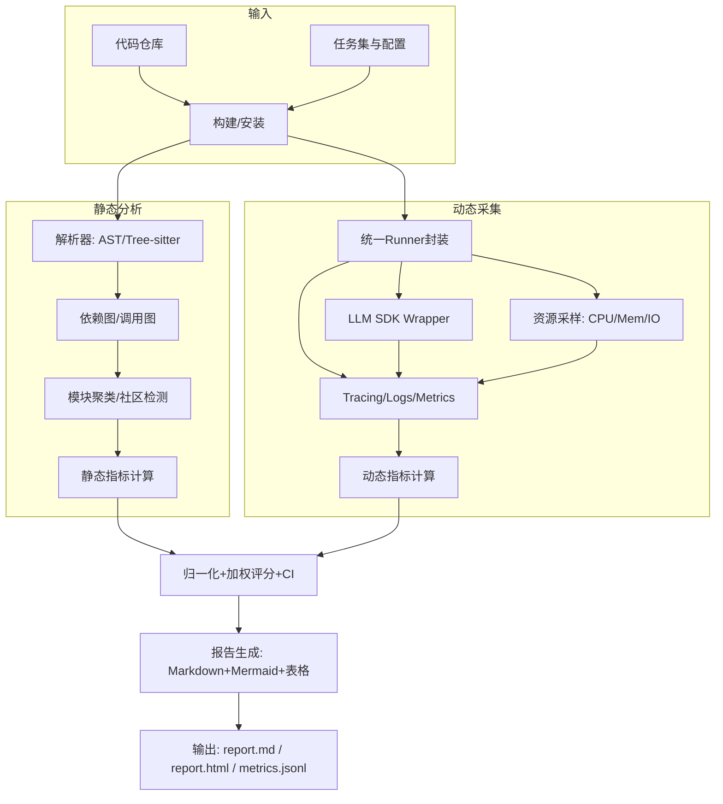
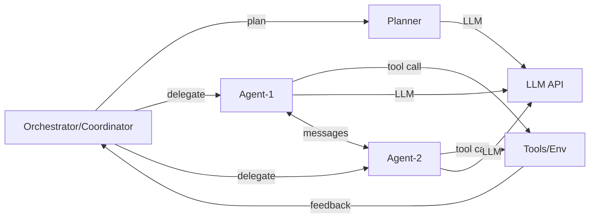
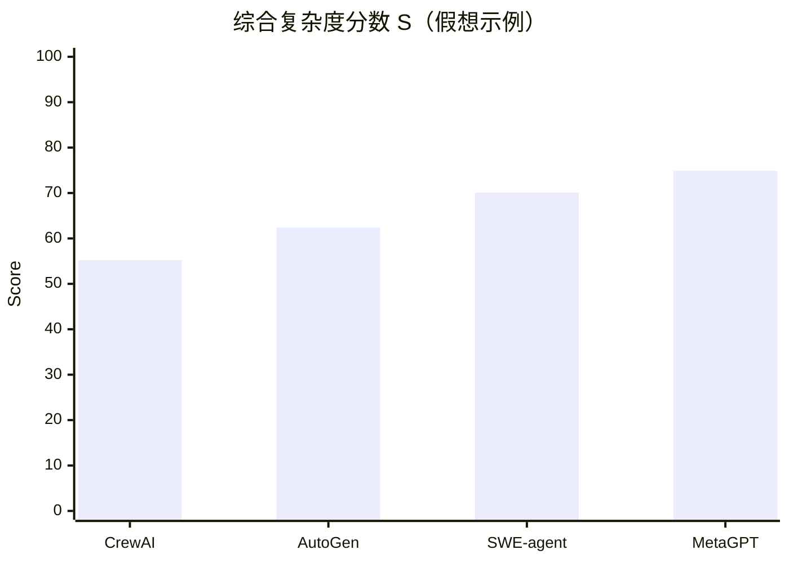
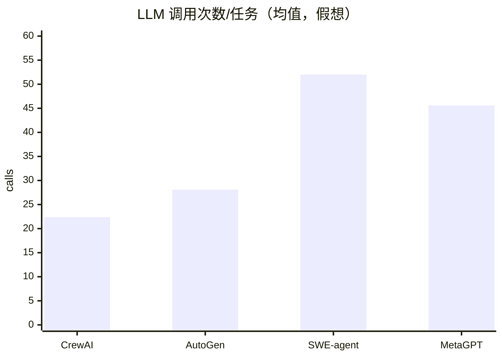

# 多智能体/Agent 系统复杂度量化评估框架与自动化分析流程研究报告

## 执行摘要

多智能体（multi-agent）/Agent 系统的“复杂度”同时来自传统软件工程里的结构与可维护性负担，也来自 agentic 运行时的协同、并发、工具调用与大模型交互（prompt/上下文窗口/多轮对话）所引入的额外机制与成本。近年来的研究指出：多智能体协作并非总是收益为正——在可并行任务上可能显著提升表现，但在需要强顺序推理的任务上，协同开销与信息碎片化可能导致性能下降；同时还出现如“错误放大（error amplification）”等新型可靠性问题，提示我们需要把“协同开销、消息密度、冗余、错误传播”等过程指标纳入系统化度量。citeturn13view0turn14view0

本报告提出一套可落地的“多维度复杂度评估框架（MACE: Multi-Agent Complexity Evaluation）”，输出单一数值化复杂度分数（0–100）及置信区间，并配套一个自动化分析器（静态+动态）与实验验证方案：  
1) 在**静态侧**，针对仓库代码解析模块划分、依赖/调用图、控制流与异常处理结构、可测试性与可观测性等；2) 在**动态侧**，通过统一的运行封装与可观测性埋点收集 LLM 调用次数与 token 统计、并发度、通信频率/带宽、工具调用谱系、资源消耗与错误谱系，并以任务难度校准后汇总。框架在设计上强调：指标可计算、数据来源透明、权重可解释且可学习（默认权重 + 数据驱动校准），并提供可复现实验流程（每个 agent × 每个任务运行 N=10 次，若未指定则采用 10）。citeturn12search1turn12search9turn4search16turn9search0

## 相关工作综述

**软件复杂度度量**的经典路径是从代码结构与可维护性出发：以控制流分支为核心的圈复杂度（Cyclomatic Complexity）由 entity["people","Thomas J. McCabe","cyclomatic complexity 1976"]提出，强调独立路径数、测试工作量与结构复杂度之间的关系。citeturn0search0turn0search12 以操作符/操作数统计为基础的 Halstead 指标由 entity["people","Maurice H. Halstead","software science 1977"]系统化提出，试图用静态计数刻画“体积、难度、工作量”等。citeturn8search4turn0search9 在此基础上，维护性指数（Maintainability Index, MI）把多种传统指标组合成单值，常见实现将 LOC、圈复杂度与 Halstead 体积等混合；但也有学者提醒 MI 受尺度变换、权重任意性与语境差异影响，作为“单一真理”需谨慎。citeturn8search21turn0search2turn4search3 成本/资源估计方面，COCOMO 及其演化模型以规模与成本驱动因子估计工期/人力，为“复杂度→资源消耗”的工程化映射提供范式。citeturn8search2turn8search14turn8search22

**架构复杂度与分布式/多智能体复杂度**的文献更强调结构图与通信开销。一类工作使用依赖结构矩阵（DSM）与网络方法，把系统架构表示为有向图/邻接矩阵以分析模块耦合、核心-边缘结构与隐含依赖。citeturn3search0turn9search2turn3search8turn3search12 分布式系统中“消息复杂度（message complexity）/比特复杂度（bit/communication complexity）”常被定义为算法执行期间消息数/比特数总和，用作衡量协调成本与可扩展性的重要维度。citeturn3search17turn3search5turn3search13 对多智能体交互过程的评测也出现“把多智能体交互表示为图（DAG/对话图）再提取结构度量”的思路，例如基于交互图评估协作效率与冗余。citeturn3search14 近期更有面向“agent 系统规模化规律”的定量研究，明确提出并实证比较多种 canonical 架构（单体、独立并行、中心化、去中心化、混合），并把“通信开销、冗余、错误放大”等作为关键过程变量。citeturn14view0turn13view0

**LLM/agent 性能评测**方面，传统 LLM 评测框架（如 HELM）强调“场景×指标”的覆盖与透明化，提供对语言模型能力/风险的多维刻画。citeturn2search3turn2search7 面向“LLM 作为 agent”的评测则更强调交互式环境与多轮决策：AgentBench 提供多个环境维度评估 agent 的推理与决策能力，并给出失败类型分析。citeturn0search3turn0search7 针对更接近真实工作流的基准，GAIA 强调工具使用、检索与多模态等综合能力；WebArena 提供可复现的真实网页环境；SWE-bench 以真实代码仓库 issue/PR 构造软件工程修复任务。citeturn2search2turn2search1turn2search0 评测工具链方面，entity["company","OpenAI","ai research company"]开源的 Evals 以及其官方 eval 指南强调用“可编写的评测脚手架”持续回归测试 LLM/系统输出。citeturn9search3turn9search7

下表以“方法—优缺点”视角压缩对比（并非穷尽）：

| 方向 | 代表方法/文献 | 核心对象 | 优点 | 局限 |
|---|---|---|---|---|
| 代码结构复杂度 | McCabe 圈复杂度 | 控制流图独立路径数 | 与测试路径数量、分支结构直觉对应，易计算、工具生态成熟。citeturn0search0turn0search12 | 对数据流、架构耦合、并发与“运行时协作”覆盖不足。citeturn0search0 |
| 代码信息度量 | Halstead 指标体系 | 操作符/操作数统计 | 可静态提取，支持体积/难度等衍生量。citeturn8search4turn0search9 | 与可维护性/缺陷的相关性常依语境变化，易被编码风格影响。citeturn0search9 |
| 单值维护性 | Maintainability Index | LOC、CC、Halstead 等组合 | 用单值简化对比，工程上便于阈值化。citeturn4search3turn8search21 | 组合权重与尺度敏感，容易掩盖维度差异，被批评“不宜当作唯一指标”。citeturn0search2 |
| 架构网络方法 | 依赖图/DSM、核心-边缘结构 | 模块依赖网络 | 适合宏观架构层面的耦合、结构洞、核心化分析，可扩展到大型系统。citeturn9search2turn3search0turn3search8 | 需要高质量依赖抽取；对动态反射/运行时绑定敏感。citeturn9search2 |
| 分布式通信复杂度 | message/bit complexity | 消息数/比特数总和 | 直接量化协调代价，适合并发/分布式系统的可扩展性分析。citeturn3search17turn3search5turn3search13 | 仅衡量通信量无法捕捉语义质量、错误传播与推理碎片化。citeturn14view0 |
| Agent 基准评测 | AgentBench、GAIA、WebArena、SWE-bench | 任务成功率/过程轨迹 | 更贴近 agentic 交互环境与工具使用，能揭示失败模式。citeturn0search3turn2search2turn2search1turn2search0 | 主要评“能力/性能”，对“系统复杂度/工程成本”的量化不充分且缺少统一复杂度分数。citeturn14view0 |
| 规模化规律研究 | agent scaling 原则、错误放大 | 架构×任务属性×协同度量 | 明确提出协同开销/错误放大等过程指标，并给出架构选择的定量视角。citeturn13view0turn14view0 | 仍更偏“性能预测”，尚未形成可直接用于工程审计的“全栈复杂度度量与自动化分析器”。citeturn14view0 |

## 问题定义与研究空白

**问题定义（可操作化）**：给定一个多智能体/agent 系统实现（代码仓库 + 可运行入口 + 任务/环境），我们希望输出：  
- 一个**可解释**的复杂度向量 **C = (c₁…c_k)**（覆盖结构、并发、通信、LLM 交互、状态、异常、资源、可测试性/可观测性等）；  
- 一个**数值化综合复杂度分数** **S ∈ [0,100]**，并能在多次运行与多任务设置下估计 **置信区间**；  
- 一份可复现的证据链：每个指标来自哪里、如何计算、可否被复核。

**研究空白**主要体现在“三个断裂”：

第一，传统软件复杂度指标对 agent 系统的关键负担缺乏覆盖：prompt 模板数量与长度分布、LLM 调用频次、工具调用谱系、记忆/检索组件对状态空间的放大、agent 间消息与协调回合等，均不是 McCabe/Halstead/MI 的原生对象。citeturn0search0turn8search4turn8search21turn14view0

第二，现有 agent 评测更偏向“能力/性能”，而不是“系统复杂度/工程成本”。例如 GAIA、WebArena、SWE-bench 强调成功率与任务难度，AgentBench强调多环境评估，但它们不直接回答：为了达到同样成功率，系统付出了多大工程复杂度与运行成本？citeturn2search2turn2search1turn2search0turn0search3

第三，缺乏把**静态结构**与**动态过程**统一到同一评分空间的自动化流程：架构网络方法与分布式通信复杂度提供了方向，但需要与 LLM token 统计、可观测性埋点、并发调度与错误传播等过程数据耦合；而近期关于 agent 系统规模化规律的研究虽然提出了“开销/冗余/错误放大”等过程指标，却仍缺少面向工程审计的“指标全集 + 自动化分析器 + 实验验证模板”。citeturn9search2turn3search17turn13view0turn14view0

## 度量与评分框架

本节提出 **MACE 指标集合**与**数值化评分方法**。若未指定语言/框架，默认以 Python 为主、跨语言部分用增量解析器补足，并在报告中标注“可静态/需动态/可选”的采集方式。citeturn5search0turn4search2

### 指标体系总览

将复杂度拆为六个一级维度（每维度内部由若干可计算指标构成）：

- **结构与模块化复杂度（A）**：模块数、依赖/调用图规模与循环、聚类模块化程度、核心-边缘结构等（强调可维护性与演化风险）。citeturn9search2turn3search8turn3search0  
- **并发与执行拓扑复杂度（B）**：线程/进程/async 任务并发、调度与同步原语使用、并行度峰值等。citeturn6search1turn6search2turn5search6  
- **通信与协同复杂度（C）**：agent 间消息频率、带宽、协调回合、冗余、错误放大等过程度量。citeturn3search17turn14view0  
- **LLM 交互复杂度（D）**：LLM 调用次数、token 用量、prompt 长度分布、模板多样性、工具调用密度等。citeturn12search1turn12search9turn12search0  
- **状态空间与异常处理复杂度（E）**：显式/隐式状态规模、记忆/检索带来的状态放大、异常分支与恢复策略复杂度。citeturn14view0turn3search14  
- **资源、可测试性与可观测性（F）**：CPU/内存/时延/成本估计，可测试性（测试覆盖/可复现性开关），可观测性（trace/log/metric 完整度）。citeturn6search3turn15search0turn4search16  

### 指标定义、计算方法、权重建议与数据来源

为可读性，分为“静态主导指标”和“动态主导指标”两张表。默认权重给出一个可用起点（总和=100），并建议在实验数据上进行校准（见本节末）。  

**表：静态主导指标（无需运行即可计算，或以静态为主）**

| 代码 | 指标（建议单位） | 定义与计算方法（要点） | 数据来源 | 默认权重 |
|---|---|---|---|---:|
| A1 | 模块/包数量 (#) | 以包/模块边界统计（Python: package+module；多语言：按目录/构建单元），并以“有效模块数=去除测试/样例/脚本后的模块数”为主。 | 文件树 + 解析器；Python 可用标准库解析 AST。citeturn5search0 | 4 |
| A2 | 函数/方法规模 (#) | 可调用实体数量：函数、方法、类方法、工具函数等；用于归一化其他图指标。 | AST/增量解析；Python `ast`。citeturn5search0 | 2 |
| A3 | 依赖图规模 (|V|,|E|) | 节点=模块；边=import/依赖；输出节点数、边数、密度。 | import/依赖抽取；DSM/网络方法思想。citeturn3search0turn9search2 | 4 |
| A4 | 依赖环与强连通 (SCC) | 计算强连通分量数量、最大 SCC 占比；环越大通常越难解耦与测试。 | 图算法（NetworkX 等）；架构网络分析常用。citeturn9search2 | 5 |
| A5 | 调用图规模 (|V|,|E|) | 以静态调用图（函数/方法级别）统计，并记录缺失率（无法解析的动态调用）。 | 静态调用图工具（PyCG/pyan）。citeturn11search1turn11search0 | 5 |
| A6 | 调用图复杂度（图圈复杂度） | 用有向图的回路度量（如 cyclomatic number：E−V+P）或等价结构度量，反映潜在路径数增长。 | 调用图 + 图算法；与 McCabe CFG 思想同源但对象是跨函数图。citeturn0search0turn9search2 | 4 |
| A7 | 模块化聚类质量（modularity） | 对依赖图/调用图做社区划分（Louvain等）并计算模块度；模块度低→耦合更强。 | 社区检测（Louvain 方法）。citeturn9search1turn5search3 | 4 |
| A8 | 代码结构复杂度（CC） | 圈复杂度的均值/分位数（p90、p99）与“超阈值函数比例”。 | 代码度量工具（Radon 等）。citeturn4search7turn0search0 | 5 |
| A9 | Halstead 体积/难度分布 | 统计 Halstead Volume/Difficulty 的均值与长尾（p95）。 | Radon 等工具实现 Halstead。citeturn4search7turn8search4 | 3 |
| A10 | 异常处理结构复杂度 | try/except/finally 数量、嵌套深度、捕获异常类型多样性、宽泛捕获比例（如 bare except）。 | AST 规则扫描；可用 Semgrep 规则补强。citeturn5search0turn4search1 | 5 |
| A11 | 配置/策略分支复杂度 | 配置项数量（env/ YAML / JSON / flags），以及影响执行路径的条件分支数量。 | 配置文件解析 + AST 条件扫描。 | 3 |
| F1 | 可测试性（静态） | 测试目录比例、测试文件数、是否存在 CI/测试入口；作为“可测性先验”。 | 文件树 + pytest 约定。citeturn15search18 | 3 |
| F2 | 可观测性（静态） | 是否集成 tracing/logging 框架（如 OpenTelemetry SDK、结构化日志）；是否存在统一 trace_id。 | 依赖扫描/导入扫描；OpenTelemetry 规范指引。citeturn4search16turn4search12 | 3 |

**表：动态主导指标（需运行/或运行后更准确）**

| 代码 | 指标（建议单位） | 定义与计算方法（要点） | 数据来源 | 默认权重 |
|---|---|---|---|---:|
| B1 | 线程数峰值 | 运行期间活跃线程峰值与均值。 | Python `threading` 语义 + 运行时采样。citeturn6search1 | 3 |
| B2 | 进程数峰值 | 进程峰值/均值；含工具子进程。 | Python `multiprocessing` / OS 采样。citeturn6search2 | 3 |
| B3 | async 并发度 | asyncio Task 峰值/均值、调度回合数。 | asyncio 任务机制；可用包装器统计 `create_task` 等。citeturn5search6turn5search2 | 4 |
| C1 | agent 数量（运行态） | 实际参与的 agent 实例数（含工具代理/规划器/反思器）。 | 框架钩子或消息总线注册。citeturn13view0turn14view0 | 4 |
| C2 | 消息频率（msg/s） | agent 间消息条数/秒；按通道/角色分解。 | 统一消息总线埋点；或解析对话记录 DAG。citeturn3search14turn14view0 | 5 |
| C3 | 通信带宽（bytes/s） | 消息序列化后字节数/秒；可分 text/code/tool args。 | 消息层埋点；分布式通信复杂度概念。citeturn3search13turn3search17 | 4 |
| C4 | 协调回合数 | 中心化编排的 orchestrator 轮次、去中心化辩论轮次等。 | 框架事件；与 canonical 架构对齐记录。citeturn13view0turn14view0 | 4 |
| C5 | 冗余率（协作低效） | 交互图中“重复信息/重复推理步骤”比例（可用 n-gram/embedding 相似度近似）。 | 交互图评测思路。citeturn3search14turn14view0 | 3 |
| C6 | 错误放大系数 | 一个子 agent 错误导致最终失败的倍率估计；可用“局部错误→全局失败”条件概率比近似。 | 过程标注 + 日志；规模化研究引入该概念。citeturn13view0turn14view0 | 6 |
| D1 | LLM 调用次数 | 每任务 LLM API 调用数（含重试）。 | SDK wrapper/trace span。citeturn4search16 | 6 |
| D2 | token 用量（prompt/comp/total） | 统计输入/输出/总 token，并记录分位数；对流式场景注意 usage chunk。 | 官方 API 响应 usage 字段；可配合 tiktoken 估计。citeturn12search1turn12search5turn12search0 | 7 |
| D3 | prompt 长度分布 | prompt token 长度的均值、p90、p99、Gini/熵；反映上下文管理难度。 | usage 或 tokenizer 估计；tokenizer 官方库。citeturn12search0turn12search17 | 4 |
| D4 | prompt 模板多样性 | 模板/系统提示词/角色提示的“唯一模板数”与“变体熵”。 | 静态抽取 + 运行时确证（模板 ID/哈希）。 | 3 |
| D5 | 工具调用密度 | tool/function call 次数/任务步数；工具越多协调开销越可能上升。 | agent 轨迹；规模化研究提出 tool-coordination trade-off。citeturn13view0turn14view0 | 5 |
| E1 | 状态规模近似 | 显式状态对象数量（memory slots、缓存、向量库条目等）与“状态写入频率”。 | 框架 memory 接口 + 日志；“action/state space”思想。citeturn1search13turn14view0 | 4 |
| E2 | 重试/回滚复杂度 | 重试次数分布、回滚/补偿动作数量（如撤销工具操作）。 | 运行时 trace + 错误事件。citeturn4search16 | 3 |
| F3 | CPU 时间与峰值 | 任务总 CPU 时间、CPU 峰值；可用于资源复杂度。 | psutil/系统采样。citeturn6search3 | 4 |
| F4 | 内存峰值 | RSS 峰值、对象数（可选）。 | psutil。citeturn6search3 | 4 |
| F5 | 端到端时延 | 任务完成时延分布（均值、p95）。 | trace/span；OpenTelemetry traces。citeturn4search12turn4search16 | 3 |
| F6 | 运行时可测试性 | 覆盖率（line/branch）、可重复运行（seed/确定性开关）与失败可复现度。 | Coverage.py + 评测回归；覆盖率工具。citeturn15search0turn15search4 | 4 |
| F7 | 运行时可观测性得分 | trace 完整度（span 覆盖关键阶段：规划/LLM/工具/合成）、日志结构化率、指标齐全度。 | OpenTelemetry signals（trace/metric/log）。citeturn4search16turn4search0turn4search12 | 5 |

### 综合复杂度分数与置信区间

**归一化**：对每个指标 i，计算原始值 xᵢ 后映射到 sᵢ∈[0,1]（越大越复杂）。建议三种可选策略：  
- **阈值-分段归一化**：基于工程经验阈值（例如调用图环占比>0.2 视作高风险）分段映射；适合跨项目可比。  
- **分位数归一化**：在同批对比系统集合内用分位数把 xᵢ 映射到 [0,1]；适合“横向评测”。  
- **对数/逻辑归一化**：对长尾指标（token、消息数、边数）先 log 再映射，减少极端值主导。

**综合分数**：  
\[
S = 100 \times \sum_i w_i \, s_i,\quad \sum_i w_i = 1
\]  
默认权重见上表（可解释起点），并建议在实验数据上做**权重校准**：例如以“维护成本 proxy（失败率、调试时间、平均重试、资源成本）”为目标进行回归或多目标优化；或用层次分析法先验设定再用数据微调。

**置信区间（CI）**：动态指标跨运行有随机性（LLM 采样、网络波动、环境扰动），建议对每个“系统×任务”运行 N 次（默认 N=10），得到分数样本 {S₁…S_N}；再在“任务维度+运行维度”做 bootstrap 重采样以估计 95% CI（例如取重采样分数的 2.5% 和 97.5% 分位数）。citeturn9search0turn9search16  
若系统支持固定随机性，建议启用确定性/种子参数并记录系统指纹/版本信息；在 LLM API 侧可参考提供 seed 与 system_fingerprint 的做法（若所用 API/模型支持）。citeturn12search12turn12search5

**任务难度评分（用于加权汇总）**：当任务集难度差异大时，可用基于 Item Response Theory（IRT）的方式从多模型/多系统表现估计“任务难度 θ_task”，再用难度加权汇总复杂度或性能-复杂度比；IRT 在 NLP/评测中的应用已有实践。citeturn3search7turn3search11turn3search3

## 自动化分析器设计与实现

本节给出自动化分析流程（Analyzer）架构：输入为仓库 + 运行配置 + 任务集；输出为指标明细、可视化报告（含 Mermaid 图）、以及可复现的原始数据包。

### 架构概览

Analyzer 分为五层：  
- **采集层**：仓库抓取/构建、运行封装、工具/LLM 调用拦截、资源采样。  
- **抽象层**：统一事件模型（call/message/tool/llm/span/error/state）。  
- **分析层**：静态解析、图构建、聚类、指标计算。  
- **评分层**：归一化、权重合成、CI 估计、敏感性分析。  
- **报告层**：Markdown + Mermaid + 表格/图表生成，导出 JSON/CSV/Parquet。

下面给出一个可直接用于实现的流程图（Mermaid）：

### 关键实现细节

**静态代码解析与图抽取**  
- Python 语法树：使用标准库 `ast` 构建语法树并遍历提取函数/类/异常块/条件结构等。citeturn5search0  
- 跨语言解析：使用增量解析器 Tree-sitter 生成具体语法树，降低对语言的耦合度（尤其当候选仓库含 TypeScript/Go）。citeturn4search2turn4search6  
- 调用图：优先采用有论文/方法说明的静态调用图生成器（如 PyCG），并记录“无法解析的调用比例”以避免静态图过度自信；也可用 pyan 作为轻量备选。citeturn11search1turn11search0  
- 图可视化：Graphviz DOT 语言与工具链用于输出依赖/调用图；报告端可嵌 Mermaid 概览图。citeturn11search2turn11search18turn11search3  
- 模块化聚类：对依赖图/调用图做社区检测（Louvain 等）得到模块簇与模块度。citeturn9search1turn5search3  

**LLM 调用识别与 prompt 抽取**  
- 对 entity["company","OpenAI","ai research company"] 等 API：优先读取官方返回的 usage 字段（prompt_tokens、completion_tokens、total_tokens 等），并对流式调用启用 include_usage（若可用），把“缺失 usage 的调用”单独计数。citeturn12search1turn12search5turn12search9  
- tokenizer：对无法直接获得 token 的情况，用 tiktoken 进行近似估计，并记录“估计/真实”的来源标签。citeturn12search0turn12search4  
- 对 entity["company","Anthropic","ai company"]：可通过其 SDK/响应中的 usage（input_tokens/output_tokens）字段采集（视具体 API 返回）。citeturn12search19turn12search2  
- prompt 模板识别：静态侧用规则（字符串常量、模板文件、Jinja/f-string/format）+ Semgrep 规则补强；动态侧以“模板哈希（去变量化）”方式统计模板多样性。citeturn4search1turn4search17  

**并发、线程/进程与运行时调用链采集**  
- 并发：对 asyncio 任务并发度，可在关键 API（create_task、gather）外层包裹统计；对线程/进程数量，采样或从运行框架事件中记录。citeturn5search6turn6search1turn6search2  
- 函数级运行轨迹（可选）：在 Python 中可用 profiling hook（如 sys.setprofile）记录调用事件，但需评估性能开销并提供开关。citeturn7view0turn6search16  

**可观测性与数据管道**  
- 采用 entity["organization","OpenTelemetry","observability framework"] 的 trace/metric/log 作为统一载体：span 表示阶段（规划、检索、LLM、工具执行、合成），metric 表示计数/分布，log 表示结构化事件与错误。citeturn4search16turn4search12turn4search0  
- 资源采样：使用 psutil 采集进程级 CPU/内存/IO。citeturn6search3turn6search11  

### 工具/库优先级清单（优先官方/原始资料）

| 类别 | 工具/库 | 作用 | 优先级 | 依据（示例） |
|---|---|---|---|---|
| 静态解析 | Python `ast` | Python 语法树/静态结构提取 | 高 | 标准库文档。citeturn5search0 |
| 跨语言解析 | Tree-sitter | 增量解析，多语言 CST | 高 | 官方介绍与仓库。citeturn4search2turn4search6 |
| 调用图 | PyCG / pyan | 静态调用图生成 | 高/中 | 工具仓库说明。citeturn11search1turn11search0 |
| 复杂度度量 | Radon | CC、Halstead、MI 等 | 高 | 文档说明其覆盖范围。citeturn4search7turn4search3 |
| 规则扫描 | Semgrep | 识别危险模式/异常处理/LLM 调用点 | 中 | 官方文档定位为静态分析引擎。citeturn4search17turn4search13 |
| 图算法 | NetworkX | SCC、中心性、社区检测等 | 高 | 社区检测文档含 Louvain。citeturn5search3 |
| 图渲染 | Graphviz | DOT 输出、渲染调用/依赖图 | 中 | DOT 语言与工具链文档。citeturn11search2turn11search18 |
| 可观测性 | OpenTelemetry | trace/metric/log 统一采集 | 高 | 官方概念与规范。citeturn4search16turn4search12turn4search4 |
| token 估计 | tiktoken | OpenAI 模型 token 统计 | 中 | 官方仓库说明。citeturn12search0 |
| 覆盖率 | Coverage.py | 代码覆盖率（line/branch） | 中 | 官方文档与 PyPI 说明。citeturn15search0turn15search4 |
| 评测脚手架 | OpenAI Evals | LLM/系统回归评测框架 | 中 | 官方仓库与指南。citeturn9search3turn9search7 |
| 报告图表 | Mermaid | 流程图/关系图/简单图表 | 中 | Mermaid 语法文档。citeturn11search3turn11search11 |

## 实验设计与开源仓库选择

### 候选开源仓库与选择理由

实验需要覆盖不同类型的 agent 系统：领域工具型、通用多智能体编排框架、软件工程型 agent、以及强调 SOP/组织结构的多角色系统。候选仓库优先来自 entity["company","GitHub","code hosting platform"] 上活跃项目，且有可运行入口与相对清晰的文档。citeturn1search0turn1search1turn1search2turn10search0

推荐的主实验集（可按算力/时间裁剪为 3–4 个系统）：

| 系统（仓库） | 类型 | 选择理由 | 预期复杂度特征 |
|---|---|---|---|
| Biomni | 生物医学研究 agent | 公开论文与工具生态丰富（多工具/多数据库），适合测试“工具密度→协调开销”类指标；由 entity["organization","Stanford University","university, ca, us"]团队开源。citeturn1search0turn1search13turn1search7 | 工具/状态空间大、通信与检索密集。citeturn1search13 |
| AutoGen | 通用多智能体框架 | 由 entity["company","Microsoft","software company"]维护，强调可扩展多智能体系统与事件驱动框架，适合对比不同拓扑/编排模式。citeturn1search1turn1search14turn1search22 | agent 数与消息回合可控，适合做规模化消融。citeturn1search14 |
| MetaGPT | SOP/多角色协作框架 | 以“软件公司流程”隐喻组织多角色 agent，并在学术社区广泛传播（OpenReview/论文）。citeturn1search2turn1search11turn1search5 | 角色多、阶段多，结构与提示链较复杂。citeturn1search11 |
| CrewAI | 轻量多智能体编排 | 强调“精简/高性能”与可控编排，适合理解“追求简化”的工程路径。citeturn1search3turn1search9 | 结构相对简单但可能并发更高（取决于实现）。 |
| SWE-agent | 软件工程修复 agent | 与 SWE-bench 强关联，适合作性能-复杂度联合分析（单位成功率代价）。citeturn10search0turn2search0turn10search4 | 工具链（终端/编辑/测试）密集，运行时成本敏感。citeturn10search0 |
| LangChain/Open SWE（可选） | 图式 agent 运行时 | 以图结构定义 agent runtime（LangGraph 思路），适合把“流程图复杂度”与“调用图复杂度”对齐。citeturn10search6turn10search11 | 显式图结构便于静态抽取，但运行态仍随机。 |

### 任务集设计（不同类型任务）

为覆盖 agentic 特性（多轮、部分可观测、需工具/环境反馈），任务集建议至少包含四类，并允许按实际运行门槛裁剪：citeturn14view0

- **通用助理/工具使用**：GAIA（分难度级别，适合难度建模与分层分析）。citeturn2search2turn2search6  
- **网页交互**：WebArena（真实网页环境，自托管可复现）。citeturn2search1turn2search9turn2search21  
- **软件工程修复**：SWE-bench（真实 repo issue/PR）。citeturn2search0  
- **多环境 agent 基准**：AgentBench（多环境维度）。citeturn0search3turn0search7  

此外可加入“领域任务”作为外推验证：例如 Biomni 论文/站点中描述的生物医学场景任务，用于测试“工具-数据库-软件生态”下的复杂度特征。citeturn1search13turn1search7turn1search21

### 运行流程与数据采集

**运行流程（默认 N=10）**  
对每个系统 A、每个任务 t：运行 N 次（未指定则 N=10），每次记录完整轨迹与可观测性数据包；若系统支持固定随机性，则启用固定 seed，并同时记录模型版本/系统指纹。citeturn12search12

**建议采集的运行时数据（必须可量化）**  
- LLM：每次调用的 prompt/response token、时延、错误码、重试次数、模型名。citeturn12search1turn12search9turn12search5  
- 工具：工具名、参数摘要、成功/失败、外部 IO（文件/网络）规模。  
- 通信：agent 间消息条数、字节数、拓扑（谁→谁）、回合编号。citeturn3search17turn14view0  
- 并发与资源：线程/进程/async task 采样、CPU/内存峰值、端到端时延。citeturn6search3turn6search1turn5search6turn4search12  
- 错误谱系：异常类型、发生阶段（规划/LLM/工具/合成）、是否被补偿/回滚。  
- 可测试性/可复现性：覆盖率、失败复现比率（同输入是否可复现失败）。citeturn15search0  

**对比方法（建议至少两条线）**  
- **同任务同模型**：固定 LLM 与工具集合，对比不同系统架构复杂度→性能/成本变化，避免把“模型变强”误当作“架构更好”。citeturn14view0  
- **同复杂度预算**：限制 token/工具调用/回合预算，在预算内对比成功率，体现“单位复杂度效率”。citeturn14view0turn13view0  

## 结果呈现与假想样例

本节给出“报告应该长什么样”的示例片段与假想结果（为演示格式，数字为假设并已标注）。真实实验应由自动化分析器产出同结构表格与图表。

### 示例报告片段（假想）

**实验设置（假设）**：统一使用同一 LLM（模型名略），任务集为 GAIA-L1 子集（20题）+ WebArena 子集（10题），每系统每任务 N=10。对动态指标用 bootstrap 得到 95% CI。citeturn2search2turn2search1turn9search0  

**假想汇总表：综合复杂度分数与关键过程指标（示例）**

| 系统 | 复杂度分数 S（0–100） | 95% CI | LLM 调用/任务（均值） | total tokens/任务（均值） | msg/任务（均值） | 端到端时延（p95） |
|---|---:|---|---:|---:|---:|---:|
| AutoGen（示例） | 62.4 | [58.1, 66.2] | 28.1 | 61k | 210 | 145s |
| MetaGPT（示例） | 74.9 | [71.0, 79.3] | 45.6 | 98k | 380 | 260s |
| CrewAI（示例） | 55.2 | [51.6, 59.8] | 22.4 | 49k | 160 | 120s |
| SWE-agent（示例） | 70.1 | [64.4, 77.5] | 52.0 | 120k | 95 | 310s |

说明：token 统计优先取 API usage 字段，缺失时用 tokenizer 估计并单独标注比例。citeturn12search1turn12search0turn12search5  

### Mermaid 可视化示例

**示例：模块/子系统关系图（抽象模板）**  
（用于报告“结构复杂度”章节，真实图应由调用图/依赖图聚类后自动生成）

**示例：复杂度分数对比（假想柱状图）**

**示例：LLM 调用次数分布（假想）**

### 如何从原始数据计算最终分数（示意）

以系统 j 在任务 t 的第 r 次运行得到的指标向量 x(j,t,r) 为例：  
1) 对每个指标做归一化 sᵢ(j,t,r)；  
2) 得到运行级分数 S(j,t,r)=100×Σ wᵢ sᵢ；  
3) 若要任务级分数：S̄(j,t)=mean_r S(j,t,r)；  
4) 若要系统总体分数：对任务加权汇总（可用 IRT 难度权重或简单平均）；citeturn3search7turn3search11  
5) 对 (t,r) 做 bootstrap 重采样得到 95% CI。citeturn9search0turn9search16  

## 讨论与落地计划

### 方法局限、潜在攻击/规避与改进方向

**局限**  
- **静态调用图不完备**：Python/动态语言的反射、动态导入、回调注册会导致静态调用图漏边；因此框架必须输出“可解析率/不确定性”并鼓励用动态 trace 校正。citeturn11search1turn5search0  
- **token 统计一致性问题**：不同供应商/SDK 的 token 统计口径可能不同；需优先使用官方返回 usage，并对估计值打标签。citeturn12search1turn12search19turn12search0  
- **复杂度≠性能**：复杂度度量旨在刻画工程负担与运行成本，不应被误用为“越低越好”的单目标；应与任务成功率/可靠性共同呈现。citeturn14view0  

**潜在攻击/规避（Goodhart 风险）**  
- 通过“拆分/合并模块”操纵模块数、图密度；或把复杂逻辑下沉到外部服务/闭源工具以降低静态指标。  
- 使用缓存/批处理把多次 LLM 调用隐藏为一次大调用，降低调用次数但提高 prompt 长度；或反之拆分以规避 token 上限，导致指标表面改善但总体成本不降。citeturn12search22turn12search5  
- 在无监督并行架构下可能出现更高错误放大，系统可能通过“多数投票/自检”掩盖错误传播但增加冗余与成本；需用错误放大与冗余率同时约束。citeturn14view0turn13view0  

**改进方向**  
- 引入“语义有效工作量”指标：结合交互图评估信息增益/新证据比率，避免单纯惩罚消息数量。citeturn3search14  
- 结合任务属性做结构化预测：参考规模化研究中把“工具数量、可分解性、顺序依赖”作为解释变量，学习任务-架构-复杂度的映射，从而实现“复杂度预算下的最优架构推荐”。citeturn14view0turn13view0  
- 将 IRT 用于“任务难度与系统能力”解耦后，再比较复杂度，减少任务集选择偏差。citeturn3search7turn3search3  

### 可发表的创新点（论文贡献角度）

1) **把 prompt/LLM 交互与协同通信纳入复杂度体系**：相比传统代码复杂度度量，突出 agent 系统特有的“token-消息-工具回合”维度，并给出可计算定义与数据来源。citeturn12search1turn14view0  
2) **静态+动态一体化分析器**：在同一报告中并列“依赖/调用图结构”与“运行轨迹过程指标”，并输出置信区间而非单点。citeturn4search16turn9search0  
3) **复杂度评分与不确定性建模**：把解析缺失率、token 估计/真实来源等作为不确定性显式输出，提升可审计性。  
4) **任务难度校准**：用 IRT 或相关方法将任务难度从表现数据中估计出来，为复杂度-性能对比提供更公平的加权方式。citeturn3search7turn3search11  

### 论文大纲（建议）

- 引言：动机（agent 系统工程化扩张）、复杂度问题、贡献点。  
- 背景与相关工作：软件复杂度度量、分布式通信复杂度、agent 评测基准。citeturn0search0turn3search17turn2search0turn0search3  
- 问题定义：MACE 的复杂度定义与需求（可计算、可解释、可比较、可复现）。  
- 指标体系：六维度指标、公式、数据来源、权重与归一化、CI 与任务难度校准。citeturn9search0turn3search7  
- 自动化分析器：架构、静态解析、动态采集、数据模型、报告生成。citeturn5search0turn4search16turn11search1  
- 实验：开源仓库选择、任务集、运行协议、消融（不同 agent 数/拓扑/工具预算）。citeturn1search0turn2search1turn2search0turn14view0  
- 结果与讨论：复杂度分布、与成功率/成本关系、鲁棒性（攻击/规避）分析、外部效度。citeturn14view0  
- 结论与未来工作：标准化建议与社区资源释放（代码、数据、报告模板）。

### 实施时间表（假设 12 周，1 人全职；未指定则给出估算）

| 周期 | 里程碑 | 交付物 | 估算工时 |
|---|---|---|---:|
| 第 1–2 周 | 指标最终定稿与数据模型 | 指标字典 v1、事件 schema、权重默认方案 | 60 |
| 第 3–4 周 | 静态分析器 MVP | 依赖/调用图抽取、Radon 指标、聚类与基础报告 | 80 |
| 第 5–6 周 | 动态采集与埋点 | LLM wrapper、OpenTelemetry spans、psutil 资源采样 | 90 |
| 第 7–8 周 | 统一 Runner + 任务集接入 | GAIA/WebArena/SWE-bench/AgentBench 至少接入两项 | 90 |
| 第 9–10 周 | 实验跑批与统计 | N=10 跑批脚本、bootstrap CI、可视化成图 | 70 |
| 第 11 周 | 论文写作与消融实验 | 初稿 + 消融（agent 数/拓扑/工具预算） | 60 |
| 第 12 周 | 复现实验包与开源整理 | 复现指南、数据集索引、报告模板、artifact | 50 |

（若多人协作，可把“仓库适配/任务集接入”并行化；若算力受限，可先以 2–3 个系统与 2 个任务集完成验证，再扩展。）

### 附：代码/工具/数据源与优先引用来源列表

**代码与工具（建议作为 artifact 清单）**  
- 静态解析：Python `ast`（标准库）citeturn5search0；Tree-sitter（跨语言）citeturn4search2；PyCG/pyan（调用图）citeturn11search1turn11search0；Radon（CC/Halstead/MI）citeturn4search7；Semgrep（规则扫描）citeturn4search17  
- 图算法与聚类：NetworkX（含 Louvain 社区检测入口）citeturn5search3；Louvain 方法原始论文citeturn9search1  
- 可视化：Graphviz DOTciteturn11search2turn11search18；Mermaidciteturn11search11turn11search3  
- 动态采集：OpenTelemetry（trace/metric/log）citeturn4search16turn4search12；psutilciteturn6search3  
- token：tiktokenciteturn12search0；OpenAI usage 字段（官方 API Reference）citeturn12search1turn12search9；Anthropic SDK usage 示例citeturn12search19  
- 测试与覆盖：Coverage.pyciteturn15search0；pytest 参数化机制（便于批量跑任务）citeturn15search1  

**任务/基准数据源（优先原始论文与官方页）**  
- AgentBenchciteturn0search3turn0search7  
- GAIAciteturn2search2turn2search6  
- WebArenaciteturn2search1turn2search21turn2search9  
- SWE-benchciteturn2search0  
- HELM（作为评测维度组织参考）citeturn2search3turn2search7  
- OpenAI Evals（评测脚手架）citeturn9search3turn9search7  

**核心参考（优先原始/官方）**  
- McCabe 圈复杂度原始论文/文档citeturn0search0turn0search12  
- Halstead《Elements of Software Science》（图书条目）citeturn8search4（出版方：entity["company","Elsevier","academic publisher"]）  
- Maintainability Index 相关文献与讨论citeturn8search21turn0search2turn4search3  
- COCOMO/成本估计citeturn8search2turn8search14  
- 架构网络方法/DSMciteturn9search2turn3search0turn3search8  
- 分布式消息复杂度定义citeturn3search17turn3search13turn3search5  
- agent 系统规模化、协同开销与错误放大过程指标（近期系统性研究）citeturn14view0turn13view0  
- 任务难度 IRT 思路与在 NLP/评测中的应用citeturn3search7turn3search11turn3search3