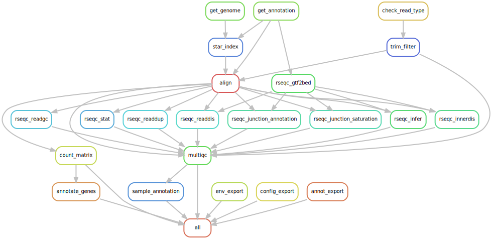

[](https://github.com/epigen/MrBiomics/)
[](https://doi.org/10.5281/zenodo.15119355)
[]()
[]()
[](https://github.com/epigen/rnaseq_pipeline/blob/main/LICENSE)

[](https://snakemake.readthedocs.io/en/stable/)

# RNA-seq Data Processing, Quantification & Annotation Pipeline
A [Snakemake](https://snakemake.readthedocs.io/en/stable/) workflow for end-to-end processing, quantification, and annotation of gene expression for RNA-seq experiments, starting from single- or paired-end reads within raw/unaligned/unmapped [uBAM](https://gatk.broadinstitute.org/hc/en-us/articles/360035532132-uBAM-Unmapped-BAM-Format) files, including a comprehensive MultiQC report.

> [!NOTE]
> This workflow adheres to the module specifications of [MrBiomics](https://github.com/epigen/MrBiomics), an effort to augment research by modularizing (biomedical) data science. For more details, instructions, and modules check out the project's repository.
>
> ⭐️ **Star and share modules you find valuable** 📤 - help others discover them, and guide our future work!

> [!IMPORTANT]  
> **If you use this workflow in a publication, please don't forget to give credit to the authors by citing it using this DOI [10.5281/zenodo.15119355](https://doi.org/10.5281/zenodo.15119355) and acknowledge the [rna-seq-star-deseq2 workflow](https://github.com/snakemake-workflows/rna-seq-star-deseq2) DOI [10.5281/zenodo.4737358](https://doi.org/10.5281/zenodo.4737358) from which some structure and code were adapted.**



# 🖋️ Authors
- [Stephan Reichl](https://github.com/sreichl)
- [Raphael Bednarsky](https://github.com/bednarsky)
- [Jake Burton](https://github.com/burtonjake)
- [Fangwen Zhao](https://github.com/fwzhao)
- [Lina Dobnikar](https://github.com/ld401)
- [Christoph Bock](https://github.com/chrbock)

# 💿 Software
This project wouldn't be possible without the following software and their dependencies.

| Software             | Reference (DOI / URL)                             |
| :-------------------: | :-----------------------------------------------: |
| Snakemake            | https://doi.org/10.12688/f1000research.29032.2    |
| STAR                 | https://doi.org/10.1093/bioinformatics/bts635|
| Samtools             | https://doi.org/10.1093/bioinformatics/btp352 |
| MultiQC              | https://doi.org/10.1093/bioinformatics/btw354     |
| RSeQC                | https://doi.org/10.1093/bioinformatics/bts356 |
| biomaRt              | https://doi.org/10.1038/nprot.2009.97 |
| gffutils             | https://github.com/daler/gffutils                 |
| GenomicRanges        | https://doi.org/10.1371/journal.pcbi.1003118      |
| rtracklayer          | https://doi.org/10.1093/bioinformatics/btp328      |
| pandas               | https://doi.org/10.5281/zenodo.3509134            |
| fastp                | https://doi.org/10.1093/bioinformatics/bty560   |
| pigz                 | https://zlib.net/pigz/                          |

# 🔬 Methods
This is a template for the Methods section of a scientific publication and is intended to serve as a starting point. Only retain paragraphs relevant to your analysis. References `[ref]` to the respective publications are curated in the software table above. Versions `(ver)` have to be read out from the respective conda environment specifications (`workflow/envs/*.yaml` file) or post-execution in the result directory (`rnaseq_pipeline/envs/*.yaml`). Parameters that have to be adapted depending on the data or workflow configurations are denoted in squared brackets e.g., `[X]`.

**Processing.** All unmapped BAM files for each sample were merged, converted to FASTQ format using Samtools [ref] (ver), processed for adapter trimming and quality filtering with fastp [ref] (ver) using parameters [`config["fastp_args"]`] (and adapters [`config["adapter_fasta"]`]), and finally de-interleaved (if paired-end) and compressed into separate R1/R2 files using shell commands and pigz [ref] (ver).

**Quantification.** Gene expression quantification was performed on the filtered and trimmed reads. The STAR aligner (ver) [ref] was utilized in `--quantMode GeneCounts` mode to count reads overlapping annotated genes based on the Ensembl [ver `config: ref: release`] gene annotation for the [`config: ref: species`] genome (build [`config: ref: build`]) and using parameters [`config["star_args"]`]. Library strandedness (`[none/yes/reverse]`, specified per sample in `config/annotation.csv`) was accounted for during counting. Counts for individual samples were aggregated into a single gene-by-sample count matrix using a custom Python script utilizing the pandas library (ver) [ref]. Quality control metrics from various tools, including fastp (ver) [ref], RSeQC (ver) [ref] and STAR (ver) [ref], were aggregated using MultiQC (ver) [ref].

**Annotation.** Gene annotations from Ensembl were retrieved using the R package biomaRt (ver) [ref]. Annotations included Ensembl gene ID, gene symbol (`external_gene_name`), gene biotype, and description. Additionally, exon-based GC content (`exon_gc`) and cumulative exon length (`exon_length`) were calculated for each gene based on the genome GFT and FASTA files using a custom R function, leveraging GenomicRanges (ver) [ref] and rtracklayer (ver) [ref]. This exon-based approach was chosen because only exonic reads are quantified during alignment and contribute to the count matrix (also sequencing reads in poly(A)-selected libraries primarily derive from exonic regions), making these metrics more appropriate for downstream bias correction (e.g., Conditional Quantile Normalization - CQN) than whole-gene metrics (i.e., including introns). A sample annotation file was generated, integrating input annotations with QC metrics.

The processing and quantification described here was performed using a publicly available Snakemake [ver] (ref) workflow [[10.5281/zenodo.15119355](https://doi.org/10.5281/zenodo.15119355)], which adapted code from another workflow (ref) [10.5281/zenodo.4737358](https://doi.org/10.5281/zenodo.4737358).

# 🚀 Features
This workflow offers several key advantages for RNA-seq analysis over existing pipelines:

*   **MrBiomics Module:** Designed for modularity and seamless integration with other [MrBiomics](https://github.com/epigen/MrBiomics/) analysis workflows (e.g., filtering/normalization, differential expression, unsupervised analysis) and includes example analysis recipes.
*   **Exon-Centric Annotation:** Calculates *exon-based* GC content and length, providing more accurate metrics for downstream bias correction (like CQN).
*   **Robust Input Handling:** Starts directly from raw uBAM files and includes automated checks to ensure consistency between annotated read types (single/paired) and BAM file content.
*   **Efficiency Focused:** Optimized for performance and disk space using data streaming between processing steps and temporary intermediate files.
*   **User-Friendly:** Offers comprehensive documentation, clear configuration, standard Snakemake usage, and practical usage tips including detailed QC guidelines.
*   **Downstream-Ready Output:** Generates additionally to a count matrix, both gene and sample annotation files specifically formatted for easy use with common downstream analysis tools and modules.

---

The workflow performs the following steps that produce the outlined results:

- **Processing:**
    - Automatically verifies (using samtools view) that the `read_type` (single/paired-end) specified in the annotation matches the actual flags within the input BAM files, preventing downstream errors (`.check_read_type/{sample}.done`).
    - Combines multiple input raw/unaligned/unmapped [uBAM](https://gatk.broadinstitute.org/hc/en-us/articles/360035532132-uBAM-Unmapped-BAM-Format) files per sample into a single stream (using `samtools merge`).
    - Converts the merged BAM stream into FASTQ format, handling paired-end interleaving (using `samtools fastq`).
    - Processes the FASTQ stream for adapter trimming and quality filtering using `fastp`, generating QC reports (`fastp/{sample}/`).
    - De-interleaves the filtered FASTQ stream into separate compressed R1 and R2 files for paired-end data, or compresses directly for single-end data using shell commands and `pigz`.
> [!NOTE]  
> `fastp` adapter auto-detection is disabled because we use STDIN mode (i.e., stream the data through pipes) to be disk space efficient.
> We do not deduplicate aligned reads. ["...the computational removal of duplicates does improve neither accuracy nor precision and can actually worsen the power and the False Discovery Rate (FDR) for differential gene expression."](https://www.nature.com/articles/srep25533)
- **Quantification:**
    - Uses STAR `GeneCounts` to quantify reads per gene based on the specified Ensembl reference genome and annotation (`star/{sample}/`).
    - Handles unstranded, forward-stranded, and reverse-stranded library protocols based on the `strandedness` column.
    - Aggregates counts into a single matrix (`counts/counts.csv`).
- **Annotation:**
    - Outputs gene annotations (`counts/gene_annotation.csv`).
      - Retrieves gene annotations (Ensembl ID, gene symbol, biotype, description) from Ensembl using `biomaRt`.
      - Calculates **exon-based** GC content and cumulative exon length for each gene using the genome's GFT and FASTA files.
    - Outputs a sample annotation table containing sample-wise general MultiQC statistics (`counts/sample_annotation.csv`).
> [!NOTE]
> Gene annotation can take a while since it depends on the availability of external data sources accessed via `biomaRt`.
> 
> GC-content and length are **exon-based**, because we only use exonic reads during the count matrix generation. Furthermore, in poly(A)‑selected libraries (such as Illumina TruSeq, Smart-seq or QuantSeq), the sequencing reads mainly come from exonic regions. Therefore, potential correction for GC bias and gene length should use exon‑level GC content and effective exon length rather than whole‑gene metrics that include introns.
- **QC & Reporting:**
    - Employs `RSeQC` tools to generate key quality metrics like strand specificity and read distribution across genomic features (`rseqc/`).
    - Aggregates QC metrics from `fastp`, `STAR` and `RSeQC` into a single report using `MultiQC` (`report/multiqc_report.html`) with [AI summaries](https://seqera.io/blog/ai-summaries-multiqc/).
    - Generates a hierarchically-clustered QC heatmap with matching metadata annotation, exported both as a PNG and an interactive HTML with metadata as tooltips.

---

The workflow produces the following directory structure:
```
{result_path}/
└── rnaseq_pipeline/
    ├── report/
    │   └── multiqc_report.html         # Aggregated QC report for all samples
    │   └── sample_annotation.png       # Hierarchically clustered heatamp of QC metrics, annotated with metadata
    │   └── sample_annotation.html      # Interactive hierarchically clustered heatamp of QC metrics, with metadata as tooltip
    ├── fastp/                          # fastp QC/filtering and adapter trimming outputs per sample
    ├── rseqc/                          # RSeQC output per sample
    ├── star/                           # STAR output per sample
    ├── counts/                         # Final quantification and annotation outputs
    │   ├── counts.csv                  # Aggregated gene count matrix (genes x samples)
    │   ├── sample_annotation.csv       # Annotation for samples (columns of counts.csv)
    │   └── gene_annotation.csv         # Annotation for genes (rows of counts.csv)
    ├── envs/                           # Exported Conda environment specifications
    └── configs/                        # Exported configuration and annotation files used for the run
```
> [!IMPORTANT]  
> Resources are downloaded automatically to `resources/{config::project_name}/rnaseq_pipeline/)`, are large (>`3GB`) and have to be manually removed if not needed anymore.

# 🛠️ Usage

Here are some tips for the usage of this workflow:

- Configure and run the workflow first for a few samples.
- Once everything works, run it for all samples.
- If you are unsure about the memory requirements for alignment (the most memory intensive step) provide the Snakemake parameter `--retries X`, where `X` denotes the number of retries, and with every retry the memory is increased to `attempts * config::mem`.
- To save disk space the intermediate gzipped `FASTQ` files are marked as temporary using Snakemake's `temp()` directive. To remove them upon successful completion you have to run Snakemake with the `--delete-temp-output` flag.

This workflow is written with Snakemake and its usage is described in the [Snakemake Workflow Catalog](https://snakemake.github.io/snakemake-workflow-catalog?usage=epigen/rnaseq_pipeline).

# ⚙️ Configuration
Detailed specifications can be found here [./config/README.md](./config/README.md)

# 📖 Examples
Explore a detailed example showcasing module usage and downstream analysis in our comprehensive end-to-end [MrBiomics Recipe](https://github.com/epigen/MrBiomics?tab=readme-ov-file#-recipes) for [RNA-seq Analysis](https://github.com/epigen/MrBiomics/wiki/RNA%E2%80%90seq-Analysis-Recipe), including data, configuration, annotation and results.

# 🔍 Quality Control
Below are some guidelines for the manual quality control of each sample using the generated `MultiQC` report and visualized (interactive) sample annotation, but keep in mind that every experiment/dataset is different. Thresholds are general suggestions and may vary based on experiment type, organism, and library prep.

**General Statistics** (table)
- **Read Depth (STAR)**: Count of `(Uniquely) Mapped Reads` >10M is minimum, >20M reads is optimal for differential expression analysis.
- **Alignment Rate (STAR):** `% (Uniquely) Mapped Reads` >70-80%. Low rates might indicate contamination or reference issues.
- **Read Quality (fastp):** `% > Q30` (=Percentage of reads > Q30 after filtering) > 90%. High average quality scores across reads after trimming. Ensure effective adapter removal.
- **Library Complexity (fastp):** `% Duplication` (=Duplication rate before filtering) should not be excessively high (highly variable, interpret in context of expression). Very high rates might indicate low input or PCR issues.

**Specific Statistics** (panels)
- **Read Distribution (RSeQC):** High proportion of uniquely mapped reads assigned to exonic regions (e.g., >60-70% for poly(A) mRNA-seq). Low rates could suggest gDNA contamination or high intronic reads.
- **Infer experiment (RSeQC):** For stranded protocols, >90-95% reads should match the expected strandedness. For unstranded protocols expect a ~50:50 split.

**Additional QC**
- Inspect [**Genome Browser Tracks**](https://github.com/epigen/genome_tracks/) using UCSC Genome Browser (online) or IGV (local)
    - Compare all samples to the best, based on above's QC metrics.
    - Check cell type / experiment-specific markers or sex chromosome (`X`/`Y`) for expression as **positive controls**.
    - Check e.g., developmental regions for expression as **negative controls**.
- [**Unsupervised Analysis**](https://github.com/epigen/unsupervised_analysis) (e.g., PCA or UMAP)
    - Identify outliers/drivers of variation, especially in the control samples and within replicates.

# 🔗 Links
- [GitHub Repository](https://github.com/epigen/rnaseq_pipeline/)
- [GitHub Page](https://epigen.github.io/rnaseq_pipeline/)
- [Zenodo Repository](https://doi.org/10.5281/zenodo.15119355)
- [Snakemake Workflow Catalog Entry](https://snakemake.github.io/snakemake-workflow-catalog/docs/workflows/epigen%20rnaseq_pipeline.html)

# 📚 Resources
- To convert FASTQ files to the required uBAM file format, we recommend using [Picard's FastqToSam](https://gatk.broadinstitute.org/hc/en-us/articles/360036351132-FastqToSam-Picard): 
    ```
    # ── Install Picard (adds a `picard` runner to $PATH) ──────────────────
    conda install picard --channel bioconda

    # ── single-end FASTQ → uBAM ────────────────────────────────────────────
    picard FastqToSam \
        FASTQ=/path/to/<sample>.fastq.gz \
        OUTPUT=/path/to/<sample>.ubam \
        SAMPLE_NAME=<sample_id>
    
    # ── paired-end FASTQs → uBAM ───────────────────────────────────────────
    picard FastqToSam \
        FASTQ=/path/to/<sample>_R1.fastq.gz \
        FASTQ2=/path/to/<sample>_R2.fastq.gz \
        OUTPUT=/path/to/<sample>.ubam \
        SAMPLE_NAME=<sample_id>
    ```
- Recommended compatible [MrBiomics Modules](https://github.com/epigen/MrBiomics/#-modules)
  - for upstream sample acquisition:
    - [Fetch Public Sequencing Data and Metadata Using iSeq](https://github.com/epigen/fetch_ngs/) to retrieve and prepare public data for downstream processing.
  - for downstream analyses:
      - [Genome Browser Track Visualization](https://github.com/epigen/genome_tracks/) for quality control and visual inspection/analysis of genomic regions/genes of interest or top hits.
      - [<ins>Sp</ins>lit, F<ins>ilter</ins>, Norma<ins>lize</ins> and <ins>Integrate</ins> Sequencing Data](https://github.com/epigen/spilterlize_integrate/) using the generated `counts.csv`, `sample_annotation.csv`, and `gene_annotation.csv` (especially the exon-based GC/length for CQN).
      - [Unsupervised Analysis](https://github.com/epigen/unsupervised_analysis) to explore sample relationships based on gene expression.
      - [Differential Analysis with limma](https://github.com/epigen/dea_limma) to identify differentially expressed genes between sample groups.
      - [Enrichment Analysis](https://github.com/epigen/enrichment_analysis) for biomedical interpretation of gene lists (e.g., from differential analysis).
- [fastp manual](https://github.com/OpenGene/fastp/blob/master/README.md)
- [STAR manual](https://github.com/alexdobin/STAR/blob/master/doc/STARmanual.pdf)

# 📑 Publications
The following publications successfully used this module for their analyses.
- [FirstAuthors et al. (202X) Journal Name - Paper Title.](https://doi.org/10.XXX/XXXX)
- ...

# ⭐ Star History

[](https://star-history.com/#epigen/rnaseq_pipeline&Date)

