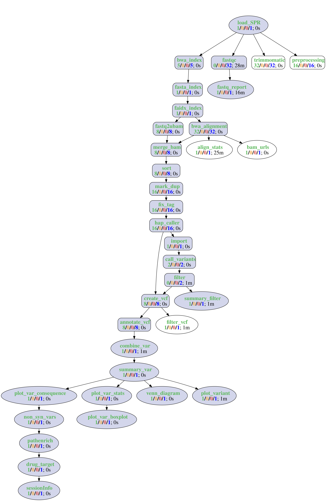
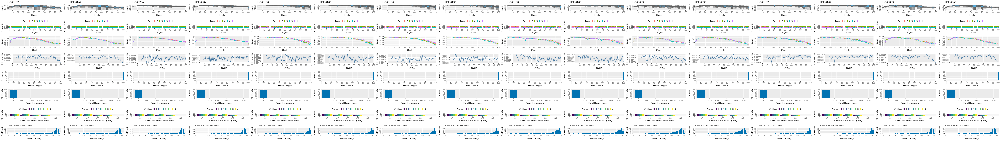
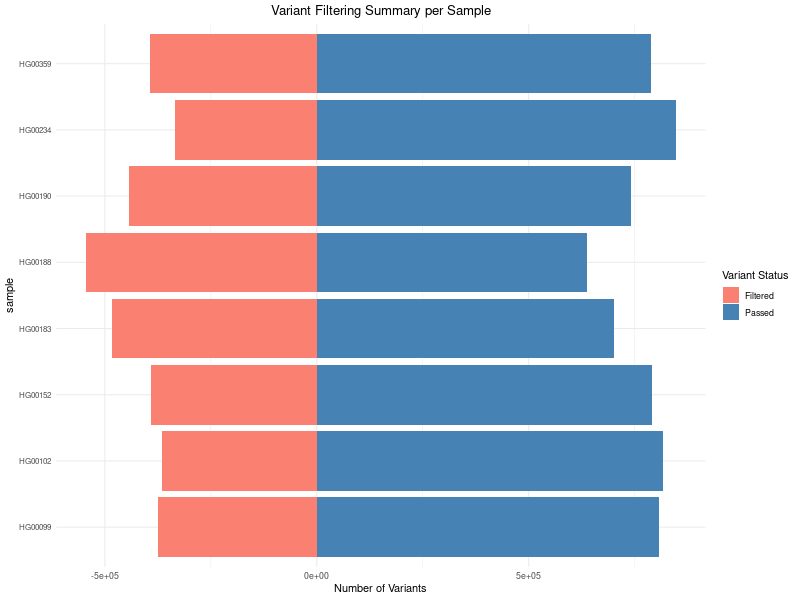
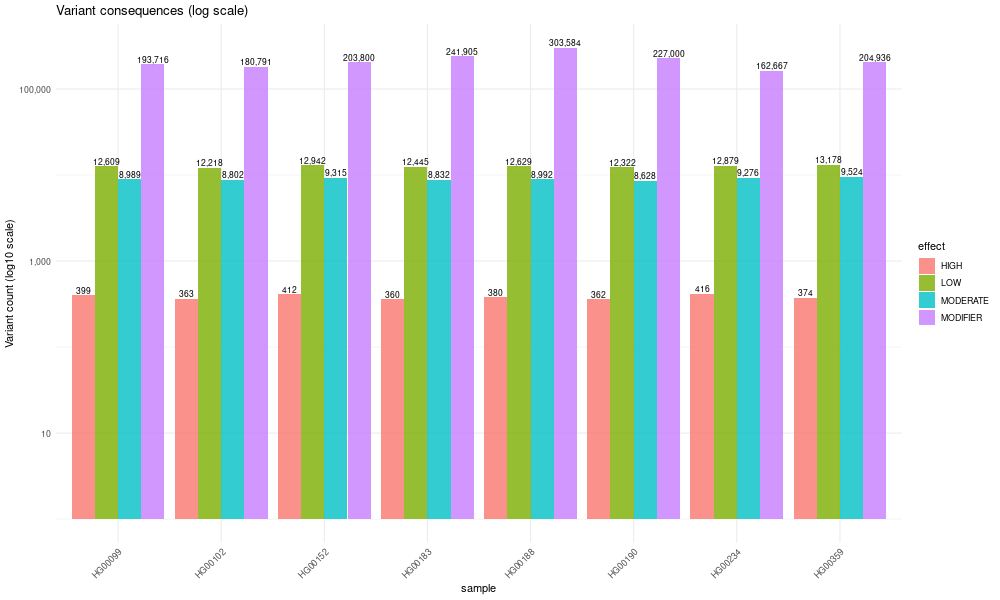
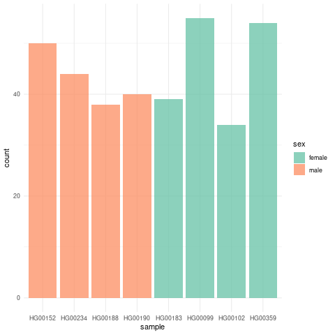
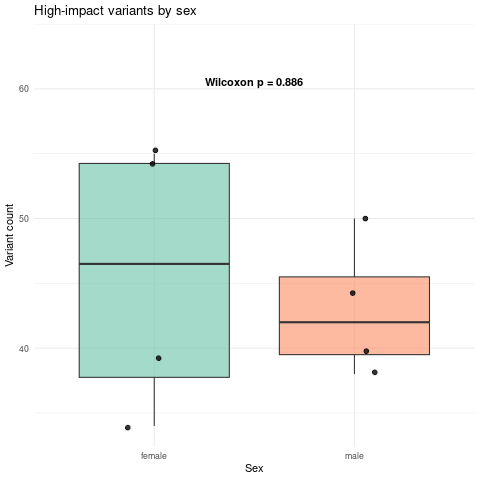
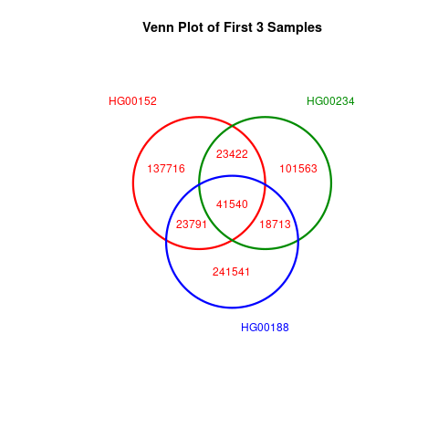
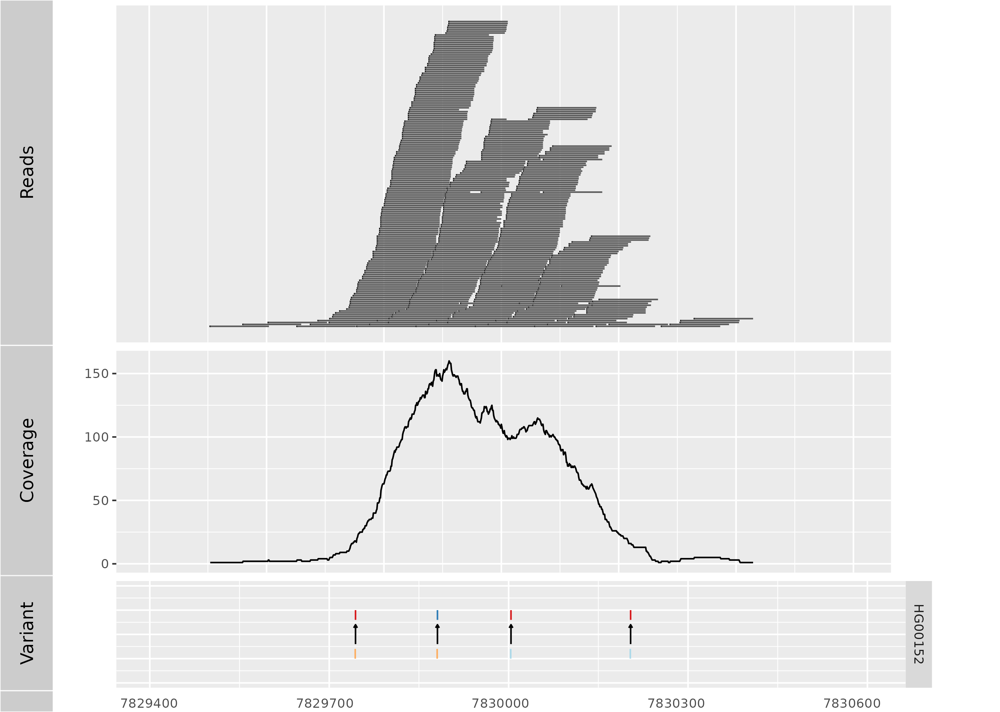

<!--
# Compile from command-line
Rscript -e "rmarkdown::render('systemPipeVARseq.Rmd', c('BiocStyle::html_document'), clean=FALSE); knitr::knit('systemPipeVARseq.Rmd', tangle=TRUE)"
-->

```{css, echo=FALSE}
pre code {
white-space: pre !important;
overflow-x: scroll !important;
word-break: keep-all !important;
word-wrap: initial !important;
}
```

```{r style, echo = FALSE, results = 'asis'}
BiocStyle::markdown()
options(width = 60, max.print = 1000)
knitr::opts_chunk$set(
    eval = as.logical(Sys.getenv("KNITR_EVAL", "TRUE")),
    cache = as.logical(Sys.getenv("KNITR_CACHE", "TRUE")),
    tidy.opts = list(width.cutoff = 60), tidy = TRUE
)
```

```{r setup, echo=FALSE, message=FALSE, warning=FALSE, eval=TRUE}
suppressPackageStartupMessages({
    library(systemPipeR)
})
```

# Introduction

## Overview

This workflow template is designed for analyzing VAR-Seq data by identifying
and annotating genomic variants (SNPs and Indels) via read alignment, GATK
variant calling, and SnpEff annotation. It is provided by [systemPipeRdata](https://bioconductor.org/packages/devel/data/experiment/html/systemPipeRdata.html), a
companion package to [systemPipeR](https://www.bioconductor.org/packages/devel/bioc/html/systemPipeR.html) [@H_Backman2016-bt]. Consistent with other
`systemPipeR` workflow templates, a single command initializes the necessary
working environment. This includes the expected directory structure for
executing systemPipeR workflows and parameter files for running the
command-line (CL) software utilized in specific analysis steps.

To facilitate easy testing, the template utilizes eight paired-end human
whole-exome FASTQ files from the 1000 Genomes Project. The dataset comprises
four male and four female samples (for details see below `targets` table), 
which are downloaded at the beginning alongside the human reference genome 
and annotations. A moderately sized exome dataset was selected to minimize 
runtime, enabling users to execute the numerous steps of this relatively 
complex workflow from start to finish without extensive computational 
overhead.

Upon successful testing, users have the flexibility to apply this template to
their own data or modify it to suit specific research needs. 
For more comprehensive information on designing and executing workflows, users
want to refer to the main vignettes of
[systemPipeR](https://www.bioconductor.org/packages/devel/bioc/vignettes/systemPipeR/inst/doc/systemPipeR.html)
and
[systemPipeRdata](https://www.bioconductor.org/packages/devel/data/experiment/vignettes/systemPipeRdata/inst/doc/systemPipeRdata.html). 

The `Rmd` file (`systemPipeVARseq.Rmd`) associated with this vignette serves a dual
purpose: it acts as a template for executing the workflow and as a framework
for generating a reproducible scientific analysis report. Thus, users
want to customize the text (and/or code) of this vignette to reflect
their specific experimental design and analysis results. This customization
typically involves removing the instructional content on how to use the
workflow and replacing it with detailed descriptions of the experimental
design, relevant metadata, and analysis findings.

## Experimental design

In this section, users should describe the sources and versions of the
reference genome sequence and corresponding annotations. The standard
`systemPipeR` directory structure (detailed
[here](https://www.bioconductor.org/packages/devel/bioc/vignettes/systemPipeR/inst/doc/systemPipeR.html#3_Directory_structure))
expects input data to be located in a subdirectory named `data`, while all
results are written to a separate `results` directory. The `Rmd` source file
for executing the workflow and rendering the report (in this case,
`systemPipeVARseq.Rmd`) is expected to reside in the parent directory.

To transition from testing to production, the provided test data
should be deleted and replaced with the custom data in the corresponding
locations.

Alternatively, a fresh environment skeleton can be created (named `new`
[here](https://www.bioconductor.org/packages/devel/data/experiment/vignettes/systemPipeRdata/inst/doc/new.html))
or built from scratch. To perform a VAR-Seq analysis with new FASTQ files using
the same reference genome, the only requirements are the FASTQ files and a
corresponding experimental design file, known as the `targets` file. The
structure and utility of targets files is described in `systemPipeR's` main
vignette
[here](https://www.bioconductor.org/packages/devel/bioc/vignettes/systemPipeR/inst/doc/systemPipeR.html#4_The_targets_file).

## Workflow steps

The default analysis steps included in this VAR-Seq workflow template are
outlined here. To visualize the workflow structure, the `plotWF` function
generates a topology graph (see below) that depicts the dependencies and
execution order of all analysis steps. Users can modify the existing steps, add
new ones or remove steps as needed.

__Default analysis steps__

1. Read preprocessing
    + FastQC report
2. Alignments: _`BWA-MEM`_ (or any other DNA aligner)
3. Alignment stats 
4. Variant calling 
    + with `GATK`, substeps 1-10
5. Filter variants
    + Filter variants called by `GATK` 
6. Annotate filtered variants with `SnpEff`
7. Combine annotation results among samples
8. Calculate summary statistics of variants
9. Various plots for variant statistics
10. Pathway enrichment analysis
11. Drug-target interaction analysis

## Load workflow environment {#load-wf}

The environment for this VAR-Seq workflow is auto-generated below with the
`genWorkenvir` function (selected under `workflow="varseq"`). It is fully
populated with the expected directories and parameter files. It also provides
the source Rmd of this vignette (`systemPipeVARseq.Rmd`). The name of the resulting workflow directory
can be specified under the `mydirname` argument. The default `NULL` uses the
name of the chosen workflow. An error is issued if a directory of the same
name and path exists already. After this, the user’s R session needs to be
directed into the resulting `varseq` directory (here with `setwd`). 

```{r generate_workenvir, eval=FALSE}
library(systemPipeRdata)
genWorkenvir(workflow = "varseq", mydirname = "varseq")
setwd("varseq")
```

The sample data for testing the workflow are downloaded next, including FASTQ
files, reference genome and annotation data. For instructional purposes, the
input data download is currently executed separately rather than being
incorporated as a workflow step. However, these downloads can be seamlessly 
integrated into the actual workflow if required.

```{r download_commands, eval=FALSE}
targets <- read.delim(system.file("extdata", "workflows", "varseq", "targetsPE_varseq.txt", package = "systemPipeRdata"), comment.char = "#")
source("VARseq_helper.R") # defines helper functions
options(timeout = 3600) # increase time limit for downloads
commands <- varseq_example_fastq(targets)
for (cmd in commands) eval(parse(text = cmd))
download_ref(ref="hg38.fa.gz")
download_tool(tool="snpEff_latest")
```

### Input data: `targets` file

The `targets` file defines the input files (e.g. FASTQ or BAM) and optional 
sample comparisons used in a data analysis workflow. It can also store any number 
of additional descriptive information for each sample. The following shows 
the first four lines of the `targets` file used in this workflow template.
Users should note that this specific file, named `targetsPE_varseq.txt`, is
located in the workflow's root directory. For demonstration purposes, the
command below retrieves this file directly from the installed package.

```{r load_targets_file, eval=TRUE}
targetspath <- system.file("extdata", "workflows", "varseq", "targetsPE_varseq.txt", package = "systemPipeRdata")
targets <- read.delim(targetspath, comment.char = "#")
targets[1:4, -(5:8)]
```

To work with custom data, users need to generate a `targets` file containing
the paths to their own FASTQ files. [Here](https://www.bioconductor.org/packages/devel/bioc/vignettes/systemPipeR/inst/doc/systemPipeR.html#4_The_targets_file) 
is a detailed description of the structure and utility of `targets` files.

# Quick start {#quick-start}

After a workflow environment has been created with the above `genWorkenvir` 
function call and the corresponding R session directed into the resulting directory (here `varseq`), 
the `SPRproject` function is used to initialize a new workflow project instance. The latter 
creates an empty `SAL` workflow management object (below `sal`) and at the same time a
linked project log directory (default name `.SPRproject`) that acts as a
flat-file database of a workflow. Additional details about this process and 
the SAL workflow control class are provided in `systemPipeR's` main vignette 
[here](https://www.bioconductor.org/packages/devel/bioc/vignettes/systemPipeR/inst/doc/systemPipeR.html#11_Workflow_control_class)
and [here](https://www.bioconductor.org/packages/devel/bioc/vignettes/systemPipeR/inst/doc/systemPipeR.html#5_Detailed_tutorial).

Next, the `importWF` function loads all the workflow steps defined in the
source `Rmd` file of this vignette (here `systemPipeVARseq.Rmd`) into the `SAL` workflow 
management object. An overview of the workflow steps and their status information can be returned
at any stage of the load or run process by typing `sal`.

```{r project_varseq, eval=FALSE}
library(systemPipeR)
sal <- SPRproject() 
# sal <- SPRproject(resume=TRUE, load.envir=TRUE) # to resume workflow if needed
sal <- importWF(sal, file_path = "systemPipeVARseq.Rmd", verbose = FALSE)
sal
```

After loading the workflow  into `sal`, it can be executed from start to finish
(or partially) with the `runWF` command. Running the workflow will only be
possible if all dependent CL software is installed on the system where the 
workflow will be executed. Their names and availability on a system can 
be listed with `listCmdTools(sal, check_path=TRUE)`. For more information 
about the `runWF` command, refer to the help file and the corresponding 
section in the main vignette 
[here](https://www.bioconductor.org/packages/devel/bioc/vignettes/systemPipeR/inst/doc/systemPipeR.html#61_Overview). 

Running workflows in parallel mode on computer clusters is a straightforward
process in `systemPipeR`. Users can simply append the resource parameters (such
as the number of CPUs) for a cluster run to the `sal` object after importing
the workflow steps with `importWF` using the `addResources` function. More
information about parallelization can be found in the corresponding section at
the end of this vignette [here](#paralellization) and in the main vignette
[here](https://www.bioconductor.org/packages/devel/bioc/vignettes/systemPipeR/inst/doc/systemPipeR.html#63_Parallel_evaluation). 

```{r run_varseq, eval=FALSE}
sal <- runWF(sal)
```
Workflows can be visualized as topology graphs using the `plotWF` function.
This creates an interactive plot with run status information for each step. 

```{r plot_varseq, eval=FALSE}
plotWF(sal)
```

```{r varseq-toplogy, eval=TRUE, warning= FALSE, echo=FALSE, out.width="100%", fig.align = "center", fig.cap= "Topology graph of VAR-Seq workflow.", warning=FALSE}

```

Scientific and technical reports can be generated with the `renderReport` and 
`renderLogs` functions, respectively. Scientific reports can also be generated 
with the `render` function of the `rmarkdown` package. The latter allows to 
include changes made to the `Rmd` file after workflow load into `SAL`, whereas 
the former uses the original version. The technical reports are based on log 
information that `systemPipeR` collects during workflow runs.

```{r report_varseq, eval=FALSE}
# Scientific report
sal <- renderReport(sal)
rmarkdown::render("systemPipeVARseq.Rmd", clean = TRUE, output_format = "BiocStyle::html_document") 

# Technical (log) report
sal <- renderLogs(sal)
```

The `statusWF` function returns a status summary for each step in a `SAL` 
workflow instance.

```{r status_varseq, eval=FALSE}
statusWF(sal)
```

While `SAL` objects are autosaved when working with workflows, it can be
sometimes safer to explicity save the object before closing R.

```{r save_sal, eval=FALSE}
# sal <- write_SYSargsList(sal)
```

# Workflow steps

The data analysis steps of this workflow are defined by the following workflow code chunks.
They can be loaded into `SAL` interactively, by executing the code of each step in the 
R console, or all at once with the `importWF` function used under the Quick start section. 
R and CL workflow steps are declared in the code chunks of `Rmd` files with the 
`LineWise` and `SYSargsList` functions, respectively, and then added to the `SAL` workflow 
container with `appendStep<-`. Only code chunks with `spr=TRUE` in their argument line 
will be recognized as workflow steps and loaded into the provided SAL workflow 
container. The syntax and usage of workflow step defintions is described 
[here](https://www.bioconductor.org/packages/devel/bioc/vignettes/systemPipeR/inst/doc/systemPipeR.html#52_Constructing_workflows). 

## Required packages and resources

The first step loads the `systemPipeR` package.

```{r load_SPR, message=FALSE, eval=FALSE, spr=TRUE}
cat(crayon::blue$bold("To use this workflow, following R packages are expected:\n"))
cat(c("'ggplot2', 'dplyr'\n"), sep = "', '")
###pre-end
appendStep(sal) <- LineWise(
    code = {
        library(systemPipeR)
        }, 
    step_name = "load_SPR"
)
```

## FASTQ quality reports

### With FastQC

This step executes [FastQC](https://www.bioinformatics.babraham.ac.uk/projects/fastqc/), a standard quality control tool for
high-throughput sequence data. It provides critical insights into
potential data issues, such as low-quality bases, sequence biases, and
contamination. These quality metrics are summarized in easy-to-interpret plots and
reports, enabling a rapid assessment of raw sequencing data quality. The
resulting analysis files (including one HTML report and one ZIP archive per 
FASTQ file) are  stored in the workflow's `results` directory. The quality 
reports are useful to determine whether adapter trimming, quality filtering
or other read preprocessing steps are required.

```{r fastqc, eval=FALSE, spr=TRUE}
appendStep(sal) <- SYSargsList(
    step_name = "fastqc",
    targets = "targetsPE_varseq.txt",
    wf_file = "fastqc/workflow_fastqc.cwl",
    input_file = "fastqc/fastqc.yml",
    dir_path = "param/cwl",
    inputvars = c(
        FileName1  = "_FASTQ_PATH1_",
        FileName2  = "_FASTQ_PATH2_"
    ),
    dependency = "load_SPR"
)
```


### With seeFastq

The `seeFastq` utility, an integral component of the `systemPipeR` package,
provides an alternative approach for read quality assessment. By utilizing
the `seeFastq` and `seeFastqPlot` functions, this step generates and
visualizes a comprehensive suite of quality statistics for the workflow's
FASTQ files. Evaluated metrics include per cycle quality box plots, base
proportions, base-level quality trends, relative k-mer diversity, length, and
occurrence distribution of reads, number of reads above quality cutoffs and
mean quality distribution. For easy comparison it can plot the metrics of all
FASTQ files next to each other. The plot can be exported to various image
formats, such as the `fastqReport_varseq.png` file generated in this example.
For a more in-depth explanation of these visual components and usage
instructions, refer to the package documentation (via `?seeFastq` or
`?seeFastqPlot`).

```{r fastq_report, eval=FALSE, message=FALSE, spr=TRUE}
appendStep(sal) <- LineWise(code = {
  fastq1 <- getColumn(sal, step = "fastqc", "targetsWF", column = 1)
  fastq2 <- getColumn(sal, step = "fastqc", "targetsWF", column = 2)
  fastq <- setNames(c(rbind(fastq1, fastq2)), c(rbind(names(fastq1), names(fastq2))))
  fqlist <- seeFastq(fastq = fastq, batchsize = 1000, klength = 8)
  png("./results/fastqReport_varseq.png", height = 650, width = 288 * length(fqlist))
  seeFastqPlot(fqlist)
  dev.off()
}, step_name = "fastq_report", 
dependency = "fastqc")
``` 



<div align="center">Figure 2: FASTQ quality report for all samples</div></br>

## Read preprocessing

The read preprocessing steps in this section are included primarily to demonstrate how
various preprocessing tools can be integrated into the workflow. However, it
is important to note that the resulting trimmed reads are not utilized in the
subsequent analysis steps of this workflow demonstration. For pipelines 
involving GATK, while adapter trimming may be beneficial, quality trimming 
is explicitly discouraged. This is because GATK possesses internal trimming utilities and utilizes the
original low-quality base information to improve the accuracy of its
probabilistic models.

### Read trimming with Trimmomatic

This step demonstrates the usage of [Trimmomatic](http://www.usadellab.org/cms/?page=trimmomatic) [@Bolger2014-yr], 
a widely used tool for trimming and cleaning FASTQ files. The `SYSargsList`
function is utilized to process the configuration files (cwl/yml) that define
the command-line instructions for Trimmomatic. Users can retrieve the exact
command-line strings for this or any other workflow step using the `cmdlist()`
function. For further details, please consult the main vignette 
[here](http://www.bioconductor.org/packages/release/bioc/vignettes/systemPipeR/inst/doc/systemPipeR.html).

```{r trimmomatic, eval=FALSE, spr=TRUE}
appendStep(sal) <- SYSargsList(
    step_name = "trimmomatic",
    targets = "targetsPE_varseq.txt",
    wf_file = "trimmomatic/trimmomatic-pe.cwl",
    input_file = "trimmomatic/trimmomatic-pe.yml",
    dir_path = "param/cwl",
    inputvars = c(
        FileName1 = "_FASTQ_PATH1_",
        FileName2 = "_FASTQ_PATH2_",
        SampleName = "_SampleName_"
    ),
    dependency = c("load_SPR"),
    run_step = "optional"
)
```

### Preprocessing with preprocessReads

Alternatively, the function _`preprocessReads`_ allows to apply predefined or custom
read preprocessing functions to the FASTQ files referenced in a
_`SYSargsList`_ container, such as quality filtering or adaptor trimming
routines. Internally, _`preprocessReads`_ uses the _`FastqStreamer`_ function from
the _`ShortRead`_ package to stream through large FASTQ files in a
memory-efficient manner. The following example performs adaptor trimming with
the _`trimLRPatterns`_ function from the _`Biostrings`_ package.
The parameters for this step are defined in the corresponding cwl/yml files.

```{r preprocessing, message=FALSE, eval=FALSE, spr=TRUE}
appendStep(sal) <- SYSargsList(
    step_name = "preprocessing",
    targets = "targetsPE_varseq.txt", dir = TRUE,
    wf_file = "preprocessReads/preprocessReads-pe.cwl",
    input_file = "preprocessReads/preprocessReads-pe.yml",
    dir_path = "param/cwl",
    inputvars = c(
        FileName1 = "_FASTQ_PATH1_",
        FileName2 = "_FASTQ_PATH2_",
        SampleName = "_SampleName_"
    ),
    dependency = c("load_SPR"),
    run_step = "optional"
)
```

## Read mapping with BWA-MEM

The NGS reads from this project are aligned to the reference genome sequence
utilizing BWA-MEM [@Li2013-oy; @Li2009-oc], a short-read aligner known for
its high tolerance of sequence variants. As noted previously, quality
trimming is not recommended for GATK workflows; consequently, the untrimmed
FASTQ files are employed for this alignment step, while the trimmed versions
generated in the optional preprocessing step are disregarded.

### Index and dictionary files

Prior to performing BWA alignment and variant calling with GATK, it is
necessary to generate the required index files. The following three steps
build the BWA index, along with the FASTA sequence dictionary and the FASTA 
index, which are essential prerequisites for read mapping and downstream 
variant analysis.

Construct BWA index for reference genome. 

```{r bwa_index, eval=FALSE, spr=TRUE}
appendStep(sal) <- SYSargsList(
    step_name = "bwa_index",
    dir = FALSE, targets = NULL,
    wf_file = "gatk/workflow_bwa-index.cwl",
    input_file = "gatk/gatk.yaml",
    dir_path = "param/cwl",
    dependency = "load_SPR"
)
```

Construct FASTA sequence dictionary of reference genome (.dict file)
required by GATK.

```{r fasta_index, eval=FALSE, spr=TRUE}
appendStep(sal) <- SYSargsList(
    step_name = "fasta_index",
    dir = FALSE, targets = NULL,
    wf_file = "gatk/workflow_fasta_dict.cwl",
    input_file = "gatk/gatk.yaml",
    dir_path = "param/cwl",
    dependency = "bwa_index"
)
```

Create corresponding dictionary index.

```{r faidx_index, eval=FALSE, spr=TRUE}
appendStep(sal) <- SYSargsList(
    step_name = "faidx_index",
    dir = FALSE, targets = NULL,
    wf_file = "gatk/workflow_fasta_faidx.cwl",
    input_file = "gatk/gatk.yaml",
    dir_path = "param/cwl",
    dependency = "fasta_index"
)
```

### Mapping reads with BWA-MEM

This steps aligns the reads to the reference genome using BWA-MEM. 
The parameter settings of the aligner are defined in the cwl/yml files 
used in the following code chunk. The following shows how to construct the
alignment step and append it to the `SAL` workflow container. 

```{r bwa_alignment, eval=FALSE, spr=TRUE}
appendStep(sal) <- SYSargsList(
    step_name = "bwa_alignment",
    targets = "targetsPE_varseq.txt",
    wf_file = "gatk/workflow_bwa-pe.cwl",
    input_file = "gatk/gatk.yaml",
    dir_path = "param/cwl",
    inputvars = c(
        FileName1 = "_FASTQ_PATH1_",
        FileName2 = "_FASTQ_PATH2_",
        SampleName = "_SampleName_"
    ),
    dependency = c("faidx_index")
)
```

## Read and alignment stats

This step generates an alignment summary file, here named `alignStats_varseq.xls`.
It provides a comprehensive breakdown of the sequencing data,
detailing the total number of reads per FASTQ file and the quantity of reads
successfully aligned to the reference genome, presented as both absolute
counts and percentages.

```{r align_stats, eval=FALSE, spr=TRUE}
appendStep(sal) <- LineWise(
    code = {
        bampaths <- getColumn(sal, step = "bwa_alignment", "outfiles", column = "samtools_sort_bam")
        fqpaths <- getColumn(sal, step = "bwa_alignment", "targetsWF", column = "FileName1")
        read_statsDF <- alignStats(args = bampaths, fqpaths = fqpaths, pairEnd = TRUE)
        write.table(read_statsDF, "results/alignStats_varseq.xls", row.names = FALSE, quote = FALSE, sep = "\t")
    },
    step_name = "align_stats",
    dependency = "bwa_alignment",
    run_step = "optional"
)
```

The resulting `alignStats_varseq.xls` file can be included in the report as shown below (here restricted to the 
first four rows).

```{r align_stats_view, eval=TRUE}
read.table("results/alignStats_varseq.xls", header = TRUE)[1:4,]
```

## Sym links for viewing BAM files in IGV

The `symLink2bam` function creates symbolic links to view the BAM alignment files
in a genome browser such as IGV without moving these large files to a local
system. The corresponding URLs are written to a file with a path specified
under `urlfile`, here `IGVurl.txt`. To make the following code work, users need to
change the directory name (here `<somedir>`), and the url base and user names (here 
`<base_url>` and `<username>`) to the corresponding names on their system.

```{r bam_urls, eval=FALSE, spr=TRUE}
appendStep(sal) <- LineWise(
    code = {
        bampaths <- getColumn(sal, step = "bwa_alignment", "outfiles", column = "samtools_sort_bam")
        symLink2bam(
            sysargs = bampaths, htmldir = c("~/.html/", "<somedir>/"),
            urlbase = "<base_url>/~<username>/",
            urlfile = "./results/IGVurl.txt"
        )
    },
    step_name = "bam_urls",
    dependency = "bwa_alignment",
    run_step = "optional"
)
```

### Variant calling with GATK

This section executes variant calling utilizing GATK, with configurations adapted
from the GATK Best Practices guidelines [here](https://software.broadinstitute.org/gatk/best-practices/). 
The process includes ten
integrated substeps, with all corresponding command-line parameter files
located in the param/cwl/gatk directory. It is important to note that Base
Quality Score Recalibration (BQSR) and Variant Quality Score Recalibration
(VQSR) are not included in this default workflow configuration. These steps
rely heavily on high-quality, species-specific known variant resources (often
limited to model organisms like humans); their exclusion ensures the workflow
remains broadly applicable to a diverse range of species.

### Step1: fastq to ubam

This step converts raw fastq files into unmapped bam (ubam) format. This
process attaches essential Read Group (RG) metadata - such as sample ID and
sequencing platform - directly to the reads while preserving original base
qualities, which is critical for GATK's downstream error modeling. It is
vital to accurately specify the sequencing platform, which defaults to
`illumina`. If a different platform is utilized, users must modify the
configuration file `param/cwl/gatk/gatk_fastq2ubam.cwl` accordingly to ensure
the variant caller applies the correct parameter adjustments in later stages.

```{r fastq2ubam, eval=FALSE, spr=TRUE}
appendStep(sal) <- SYSargsList(
    step_name = "fastq2ubam",
    targets = "targetsPE_varseq.txt",
    wf_file = "gatk/workflow_gatk_fastq2ubam.cwl",
    input_file = "gatk/gatk.yaml",
    dir_path = "param/cwl",
    inputvars = c(
        FileName1 = "_FASTQ_PATH1_",
        FileName2 = "_FASTQ_PATH2_",
        SampleName = "_SampleName_"
    ),
    dependency = c("faidx_index")
)
```

### Step2: Merge bam and ubam

This step merges the aligned bam file (generated by the aligner) with the
unmapped ubam file (from Step 1) to create a unified bam file. This process
restores critical metadata and original sequence information - such as original
base quality scores and read group tags - that are often discarded or altered
by aligners like BWA. Retaining this "removed" information is essential for
accurate downstream variant statistics and error modeling. While adhering to
these data-merging steps is highly recommended for optimal results, variant
calling can technically be performed without them, albeit with potentially
reduced accuracy.

```{r merge_bam, eval=FALSE, spr=TRUE}
appendStep(sal) <- SYSargsList(
    step_name = "merge_bam",
    targets = c("bwa_alignment", "fastq2ubam"),
    wf_file = "gatk/workflow_gatk_mergebams.cwl",
    input_file = "gatk/gatk.yaml",
    dir_path = "param/cwl",
    inputvars = c(
        bwa_men_sam = "_bwasam_",
        ubam = "_ubam_",
        SampleName = "_SampleName_"
    ),
    rm_targets_col = c("preprocessReads_1", "preprocessReads_2"),
    dependency = c("bwa_alignment", "fastq2ubam")
)
```


### Step3: Sort bam files by genomic coordinates

This step sorts the aligned bam files according to their genomic coordinates. Coordinate sorting is a mandatory prerequisite for many downstream analysis
tools, including `MarkDuplicates` and `HaplotypeCaller`. These tools require
reads to be ordered sequentially along the reference genome to efficiently
identify duplicates and call variants.

```{r sort, eval=FALSE, spr=TRUE}
appendStep(sal) <- SYSargsList(
    step_name = "sort",
    targets = "merge_bam",
    wf_file = "gatk/workflow_gatk_sort.cwl",
    input_file = "gatk/gatk.yaml",
    dir_path = "param/cwl",
    inputvars = c(merge_bam = "_mergebam_", SampleName = "_SampleName_"),
    rm_targets_col = c(
        "bwa_men_sam", "ubam", "SampleName_fastq2ubam",
        "Factor_fastq2ubam", "SampleLong_fastq2ubam",
        "Experiment_fastq2ubam", "Date_fastq2ubam"
    ),
    dependency = c("merge_bam")
)
```

### Step4: Mark duplicates

This step identifies and marks PCR duplicates introduced during
library preparation and sequencing. The duplicate information (see
`duplicate_metrics` file) is not used in the subsequent steps. It is
generated here to assess the duplication rate and complexity of the 
sequencing libraries.

```{r mark_dup, eval=FALSE, spr=TRUE}
appendStep(sal) <- SYSargsList(
    step_name = "mark_dup",
    targets = "sort",
    wf_file = "gatk/workflow_gatk_markduplicates.cwl",
    input_file = "gatk/gatk.yaml",
    dir_path = "param/cwl",
    inputvars = c(sort_bam = "_sort_", SampleName = "_SampleName_"),
    rm_targets_col = c("merge_bam"),
    dependency = c("sort")
)
```

### Step5: Fixing tags

This step calculates NM, MD, and UQ tags for the BAM files. They provide the
edit distance to the reference (NM), the string encoding of mismatched bases
(MD), and the Phred likelihood of alignment uniqueness (UQ). The tags can be
used for precise variant calling and downstream filtering. While highly
recommended to ensure the alignment file contains standard metadata required
by many analysis tools, this step is technically optional and can be skipped
if the specific variant calling pipeline does not mandate these
pre-calculated metrics.

```{r fix_tag, eval=FALSE, spr=TRUE}
appendStep(sal) <- SYSargsList(
    step_name = "fix_tag",
    targets = "mark_dup",
    wf_file = "gatk/workflow_gatk_fixtag.cwl",
    input_file = "gatk/gatk.yaml",
    dir_path = "param/cwl",
    inputvars = c(mark_bam = "_mark_", SampleName = "_SampleName_"),
    rm_targets_col = c("sort_bam"),
    dependency = c("mark_dup")
)
```

This completes the sample preprocessing phase. All necessary
analysis-ready BAM files and their corresponding .bai indix files have been
generated. The workflow now proceeds to the variant discovery stage, where
`HaplotypeCaller` is utilized for both individual and cohort-based variant
calling.

### Step6: HaplotypeCaller

In this step, the HaplotypeCaller is executed in gVCF mode . The "g" denotes 
"genomic," indicating that the generated file
contains records for all sites, including non-variant blocks, rather than
just the variant sites. By retaining information on homozygous reference
sites, the gVCF format provides the essential data required for the
subsequent cohort calling step. This allows the joint genotyping tool to
accurately validate variants across the population by distinguishing between
"no variant present" and "no data available."

```{r hap_caller, eval=FALSE, spr=TRUE}
appendStep(sal) <- SYSargsList(
    step_name = "hap_caller",
    targets = "fix_tag",
    wf_file = "gatk/workflow_gatk_haplotypecaller.cwl",
    input_file = "gatk/gatk.yaml",
    dir_path = "param/cwl",
    inputvars = c(fixtag_bam = "_fixed_", SampleName = "_SampleName_"),
    rm_targets_col = c("mark_bam"),
    dependency = c("fix_tag")
)
```

### Step7: Import all gvcfs

To facilitate efficient cohort-wide variant calling in the subsequent step,
it is highly recommended to consolidate all single-sample gVCF files into a
GenomicsDB workspace (see [TileDB](https://github.com/Intel-HLS/GenomicsDB/wiki)). 
This database, built upon the TileDB array framework, optimizes data storage 
and access speeds for large-scale analyses.

Note: For analyses involving non-diploid data or specific scenarios where
GenomicsDB is not suitable, users should utilize the CombineGVCFs function
from GATK as an alternative . If this method is chosen, the `gvcf_db_folder`
parameter in the `param/cwl/gatk/gatk.yaml` configuration file must be updated
to point to the resulting combined gVCF file path.

Important: Before initiating this step, ensure that all sample `.g.vcf.gz`
files and their corresponding tabix index (.tbi) files are successfully
generated and located within the results directory.

```{r import, eval=FALSE, spr=TRUE}
appendStep(sal) <- SYSargsList(
    step_name = "import",
    targets = NULL, dir = FALSE,
    wf_file = "gatk/workflow_gatk_genomicsDBImport.cwl",
    input_file = "gatk/gatk.yaml",
    dir_path = "param/cwl",
    dependency = c("hap_caller")
)
```

### Step8: Joint genotyping (cohort calling)

This step performs joint genotyping — commonly referred to as cohort
calling - utilizing the GenotypeGVCFs tool. By evaluating genomic 
information across the entire cohort simultaneously (accessed via the 
GenomicsDB or combined gVCF from the previous step), the algorithm leverages
population-wide statistics to resolve ambiguous sites and improve calling
accuracy. The output is a unified, multi-sample VCF file (default name:
samples.vcf.gz) containing the raw variant calls for all samples, which
serves as the input for subsequent filtering and annotation.

```{r call_variants, eval=FALSE, spr=TRUE}
appendStep(sal) <- SYSargsList(
    step_name = "call_variants",
    targets = NULL, dir = FALSE,
    wf_file = "gatk/workflow_gatk_genotypeGVCFs.cwl",
    input_file = "gatk/gatk.yaml",
    dir_path = "param/cwl",
    dependency = c("import")
)
```

### Step9: Hard filter (cohort) variants

Since Variant Quality Score Recalibration (VQSR) requires large datasets and
highly curated known-variant training resources—which are often unavailable
for non-model organisms. To be applicable to most organisms, this workflow 
employs _hard filtering_ as the standard alternative.

This step applies fixed thresholds to specific variant annotations (e.g.,
QualByDepth, FisherStrand, ReadPosRankSum) to identify and remove
low-confidence calls. The default filtering parameters are configured based
on GATK's [generic hard-filtering recommendations](https://gatkforums.broadinstitute.org/gatk/discussion/2806/howto-apply-hard-filters-to-a-call-set). 
Users are encouraged to review these settings and adjust the corresponding parameter files to match
the specific error profiles of their dataset. For more information on the
requirements and logic behind VQSR versus hard filtering, please refer to the
official [GATK documentation](https://gatk.broadinstitute.org/hc/en-us/articles/360035531612-Variant-Quality-Score-Recalibration-VQSR-).

```{r filter, eval=FALSE, spr=TRUE}
appendStep(sal) <- SYSargsList(
    step_name = "filter",
    targets = NULL, dir = FALSE,
    wf_file = "gatk/workflow_gatk_variantFiltration.cwl",
    input_file = "gatk/gatk.yaml",
    dir_path = "param/cwl",
    dependency = c("call_variants")
)
```

### Step10: Extract variants per sample

Following the joint genotyping and hard filtering stages, all variant calls
for the cohort are consolidated within a single, multi-sample VCF file. This
step separates this aggregate data, extracting variants for each individual
sample and saving them into distinct files. Importantly, this process is
configured to retain only those variants that successfully passed the
filtering criteria (marked as PASS), ensuring that the final per-sample files
contain only high-confidence calls ready for downstream interpretation.

```{r create_vcf, eval=FALSE, spr=TRUE}
appendStep(sal) <- SYSargsList(
    step_name = "create_vcf",
    targets = "hap_caller",
    wf_file = "gatk/workflow_gatk_select_variant.cwl",
    input_file = "gatk/gatk.yaml",
    dir_path = "param/cwl",
    inputvars = c(SampleName = "_SampleName_"),
    dependency = c("hap_caller", "filter")
)
```

This completes the variant calling phase. 

## Inspect VCF files 

The following section provides example code for inspecting and manipulating
VCF files within R. Please note that this step is distinct
from the automated pipeline and serves as a guide for downstream exploratory
analysis.

### Import VCFs into R

To import VCF data into R, the `readVcf` function is utilized. This loads 
the data into `VCF` or `VRanges` class objects, which provide highly 
structured and efficient formats for handling variant data, facilitating 
tasks such as custom SNP quality filtering and genomic annotation.

```{r inspect_vcf, eval=FALSE}
library(VariantAnnotation)
vcf_raw <- getColumn(sal, "create_vcf")
vcf <- readVcf(vcf_raw[1], "Homo sapiens")
vcf
vr <- as(vcf, "VRanges")
vr
```

### Filter variants in R

The `filter_vars` function facilitates flexible, post-hoc filtering of VCF files
based on user-defined quality parameters. This utility sequentially imports
each VCF file into the R environment, converts the data into an internal
`VRanges` object, applies the specified filtering logic, and exports the
remaining variants to a new, subsetted VCF file.

Filtering criteria are passed to the function as character strings. These
strings are evaluated dynamically to subset the VRanges object using standard R
indexing syntax (e.g., vr[filter, ]).

Example Scenario: The code below demonstrates filtering for variants that meet the following criteria:
(1) Read Support: minimum total read depth >= x; (2) Allele Fraction: At least 80% 
of the reads support the called variant; (3) Upstream Status: the variant must have 
passed a specific subset of "soft filters" (e.g. PASS tags) inherited from the 
upstream GATK analysis.

Note: While the GATK pipeline (specifically Steps 9 and 10) typically performs
the primary hard filtering, this R-based step is provided as an optional tool
for exploratory data analysis or secondary fine-tuning without the need to
re-execute the command-line workflow.

```{r filter_vcf, eval=FALSE, spr=TRUE}
appendStep(sal) <- LineWise(
    code = {
        source("VARseq_helper.R")
        vcf_raw <- getColumn(sal, "create_vcf")
        library(VariantAnnotation)
        filter <- "totalDepth(vr) >= 20 & (altDepth(vr) / totalDepth(vr) >= 0.8)"
        vcf_filter <- suppressWarnings(filter_vars(vcf_raw, filter, organism = "Homo sapiens", out_dir = "results/vcf_filter"))
    },
    step_name = "filter_vcf",
    dependency = "create_vcf",
    run_step = "optional"
)
```

This validation code allows users to compare the VCF files before and after the
filtering process. It serves as a quality control measure to verify the impact
of the applied filters. Please ensure that the optional `filter_vcf` step has
been successfully executed before running this comparison.

```{r check_filter, eval=FALSE}
copyEnvir(sal, "vcf_raw", globalenv())
copyEnvir(sal, "vcf_filter", globalenv())
length(as(readVcf(vcf_raw[1], genome = "Homo sapiens"), "VRanges")[, 1])
length(as(readVcf(vcf_filter[1], genome = "Homo sapiens"), "VRanges")[, 1])
```

### Filter statistics

While optional, this step is included in the default workflow configuration to
provide insight into the quality control process. It facilitates a comparative
analysis between the raw variant calls and the filtered set produced in Step 9.
By generating summary statistics and visualizations, this step allows users to
quantitatively assess the impact of the applied filtering criteria.

```{r summary_filter, eval=FALSE, spr=TRUE}
appendStep(sal) <- LineWise(
    code = {
        
          # read in the cohort VCF file
          vcf_all <- suppressWarnings(VariantAnnotation::readVcf("./results/samples_filter.vcf.gz", "Homo sapiens"))
  
          filter_values <- VariantAnnotation::filt(vcf_all)
          filter_values[is.na(filter_values)] <- "" # ensure character comparisons work
          overall_counts <- table(filter_values) |>
             dplyr::as_tibble() |>
             dplyr::arrange(dplyr::desc(n))
          
          vcf_all_ft <- VariantAnnotation::geno(vcf_all)$FT
          passes_per_sample <- apply(vcf_all_ft, 2, function(x) sum(x == "PASS", na.rm = TRUE))
          fails_per_sample <- apply(vcf_all_ft, 2, function(x) sum(x != "PASS", na.rm = TRUE))
          sample_filter_summary <- dplyr::tibble(
              sample = names(passes_per_sample),
              passed = passes_per_sample,
              filtered = fails_per_sample
          )
  
          write.table(overall_counts, file = "results/summary_filter_overall.tsv", sep = "\t", quote = FALSE, row.names = FALSE)
          write.table(sample_filter_summary, file = "results/summary_filter_per_sample.tsv", sep = "\t", quote = FALSE, row.names = FALSE)

          library(ggplot2)
          source("VARseq_helper.R")
          png("results/summary_filter_plot.png", width = 800, height = 600)
          p_filter <- plot_summary_filter_plot(sample_filter_summary)
          print(p_filter)
          dev.off()
          
          # clean up RAM
          try(rm(vcf_all, vcf_all_ft, filter_values, passes_per_sample, fails_per_sample), silent = TRUE)
          invisible(gc())

    },
    step_name = "summary_filter",
    dependency = "filter"
)
```


<div align="center">Figure 2: Variant Filtering Summary per Sample</div></br>

## Annotate variants

### Annotate variants with SnpEff

In this required step, the workflow utilizes [SnpEff](https://pcingola.github.io/SnpEff/) 
to annotate the filtered variants. SnpEff is a robust tool designed to predict the functional effects
of genetic variants on genes and proteins, providing essential biological
context (e.g. amino acid changes, impact severity) for the identified
mutations.

```{r annotate_vcf, eval=FALSE, spr=TRUE}
appendStep(sal) <- SYSargsList(
    step_name = "annotate_vcf",
    targets = "create_vcf", dir = TRUE,
    wf_file = "gatk/snpeff.cwl",
    input_file = "gatk/gatk.yaml",
    dir_path = "param/cwl",
    inputvars = c(SampleName = "_SampleName_", vcf_raw = "_vcf_raw_"),
    dependency = c("create_vcf")
)
```

### Combine annotation results among samples

Upon completion of the annotation process for each VCF file, the subsequent
step involves consolidating the results. All annotated VCFs can be imported and
organized into a single list containing large `VRanges` objects, facilitating
efficient downstream analysis and manipulation within R.

```{r combine_var, eval=FALSE, spr=TRUE}
appendStep(sal) <- LineWise(
  code = {
    vcf_anno <- getColumn(sal, "annotate_vcf", position = "outfiles", column = "ann_vcf")
    
    clean_vcf_file <- function(path) {
      lines <- readLines(path, warn = FALSE)
      if (!length(lines)) return(path)
      header_start <- which(grepl("^##fileformat=", lines, perl = TRUE))[1]
      if (is.na(header_start) || header_start <= 1) return(path)
      writeLines(lines[header_start:length(lines)], path)
      path
    }
    
    vcf_anno <- vapply(vcf_anno, clean_vcf_file, FUN.VALUE = character(1))
    vr_from_vcf <- function(path) {
      message("Importing annotated VCF: ", path)
      vcf <- suppressWarnings(VariantAnnotation::readVcf(path, "Homo sapiens"))
      
      ft <- VariantAnnotation::geno(vcf)$FT
      if (!is.null(ft) && !isTRUE(is.character(ft))) {
        ft_vec <- as.character(ft)
        ft_clean <- matrix(ft_vec, ncol = 1)
        if (!is.null(dim(ft))) {
          ft_clean <- matrix(ft_vec, nrow = nrow(ft), dimnames = dimnames(ft))
        }
        VariantAnnotation::geno(vcf)$FT <- ft_clean
      }
      suppressWarnings(as(vcf, "VRanges"))
    }
    
    vcf_vranges <- lapply(vcf_anno, vr_from_vcf)
  },
  step_name = "combine_var",
  dependency = "annotate_vcf"
)
```

### Summary table of variants

To transform the variant objects into a human-readable summary, key
annotation fields and essential variant metadata are extracted and reorganized
into a long-format table. In this structured output, each row corresponds to a
single variant annotation for a specific sample, facilitating easier inspection
and downstream analysis.

```{r summary_var, eval=FALSE, spr=TRUE}
appendStep(sal) <- LineWise(
    code = {
        source("VARseq_helper.R")
        summary_var <- extract_var_table(vcf_vranges)
        utils::write.table(summary_var, file = "results/variant_summary_long.tsv", sep = "\t", quote = FALSE, row.names = FALSE)
    },
    step_name = "summary_var",
    dependency = "combine_var"
)
```

### Plot raw variants table by consequence

This visualization step generates a summary plot displaying the frequency of
variants categorized by their predicted functional consequence for each sample. 
This allows for a rapid assessment of the mutational profile and potential biological 
impact across the cohort.

```{r plot_var_consequence, eval=FALSE, spr=TRUE}
appendStep(sal) <- LineWise(
    code = {
        library(ggplot2)
        effect_counts <- summary_var |>
          dplyr::count(sample, effect, name = "n")

        png("./results/var_consequence_log.png", width = 1000, height = 600)
        p_var_consequence_log <- ggplot(effect_counts, aes(sample, n, fill = effect)) +
        geom_col(position = "dodge", alpha = 0.8) +
        geom_text(aes(label = scales::comma(n)), position = position_dodge(width = 0.9), vjust = -0.2, size = 3) +
        scale_y_continuous(trans = "log10", labels = scales::comma_format()) +
        labs(y = "Variant count (log10 scale)", title = "Variant consequences (log scale)") +
        theme_minimal() +
        theme(axis.text.x = element_text(angle = 45, hjust = 1))
        print(p_var_consequence_log)
        dev.off()
    },
    step_name = "plot_var_consequence",
    dependency = "summary_var"
)
```


<div align="center">Figure 3: variant consequence summary (log scale)</div></br>

### Plot variants stats

This step provides a focused visualization of biologically significant
variants. Leveraging the above summary table, it quantifies and plots the
distribution of nonsynonymous changes and variants classified as HIGH impact
across all samples. This enables researchers to identify samples with a high
burden of potentially functional or pathogenic mutations.

```{r plot_var_stats, eval=FALSE, spr=TRUE}
appendStep(sal) <- LineWise(
    code = {
        library(ggplot2)
        plot_summary_data <- summary_var |>
          dplyr::filter(
            consequence %in% c(
              "nonsynonymous_variant", "stop_gained", "frameshift_variant", 
              "splice_acceptor_variant", "splice_donor_variant",
              "start_lost", "stop_lost"
            ),
            effect == "HIGH"
          ) |>
          dplyr::mutate(
            sample = factor(sample, levels = getColumn(sal, step = "annotate_vcf", position = "targetsWF", column = "SampleName")),
            sex = getColumn(sal, step = "annotate_vcf", position = "targetsWF", column = "Factor")[sample]
          )
        
        png("./results/var_summary.png")
        p_var_summary <- ggplot(plot_summary_data) +
          geom_bar(aes(x = sample, fill = sex), alpha = 0.75) +
          scale_fill_brewer(palette = "Set2") +
          theme_minimal()
        print(p_var_summary)
        dev.off()
    },
    step_name = "plot_var_stats",
    dependency = "summary_var"
)
```


<div align="center">Figure 4: high impact variant summary</div></br>


### Compare high-impact variants by group

To investigate potential disparities in the mutational burden between sample
groups (e.g., Male vs. Female), this step utilizes the `plot_summary_data` object
to generate a comparative boxplot . The visualization displays the distribution
of high-impact variants for each group and overlays a Wilcoxon rank-sum test
p-value, providing an immediate statistical assessment of the difference in
variant loads.

```{r plot_var_boxplot, eval=FALSE, spr=TRUE}
appendStep(sal) <- LineWise(
    code = {
        source("VARseq_helper.R")
        # change the sample and group columns as needed
        p_summary_boxplot <- plot_summary_boxplot(plot_summary_data, sample_col = "sample", group_col = "sex")
        library(ggplot2)
        png("./results/var_summary_boxplot.png")
        print(p_summary_boxplot)
        dev.off()
    },
    step_name = "plot_var_boxplot",
    dependency = "plot_var_stats"
)
```


<div align="center">Figure 5: distribution of high-impact variants per sex.</div></br>


## Venn diagram of variants

The venn diagram utilities defined by the `systemPipeR` package can be used to
identify common and unique variants reported for different samples
and/or variant callers. The below generates a 3-way venn diagram
comparing 3 samples.

```{r venn_diagram, eval=FALSE, spr=TRUE}
appendStep(sal) <- LineWise(
    code = {
        unique_samples <- summary_var |> dplyr::distinct(sample) |> dplyr::pull(sample)
        if (!length(unique_samples)) {
            stop("No samples available in `summary_var`; cannot draw Venn diagram.")
        }

        top_n <- min(3, length(unique_samples))
        selected_samples <- unique_samples[seq_len(top_n)]

        variant_df <- summary_var |>
            dplyr::filter(sample %in% selected_samples) |>
            dplyr::distinct(sample, seqnames, start, ref, alt) |>
            dplyr::mutate(variant_id = paste0(seqnames, ":", start, "_", ref, "/", alt))

        variant_sets <- split(variant_df$variant_id, variant_df$sample)
        vennset <- overLapper(variant_sets, type = "vennsets")
        png("./results/vennplot_var.png")
        vennPlot(vennset, mymain = "Venn Plot of First 3 Samples", mysub = "", colmode = 2, ccol = c("red", "blue"))
        dev.off()
    },
    step_name = "venn_diagram",
    dependency = "summary_var"
)
```


<div align="center">Figure 6: Venn Diagram for 3 samples</div></br>

## Plot variants programmatically 

This section demonstrates how to visualize specific genomic variants in a
genome-browser style layout using the `ggbio` package. The resulting example
plot organizes the data into three synchronized panes: the variant location, the
corresponding read alignments, and the coverage depth. The input requirements for
this step are sorted and indexed BAM files generated in GATK Step 5, as well as
variant information from the `create_vcf` step. 

```{r plot_variant, eval=FALSE, spr=TRUE}
appendStep(sal) <- LineWise(
    code = {
        source("VARseq_helper.R")
        first_high <- summary_var |>
          dplyr::filter(effect == "HIGH") |>
          head(n = 1)
        library(ggbio)
        library(VariantAnnotation)
        mychr <- as.character(first_high$seqnames)
        mystart <- as.numeric(first_high$start) - 500
        myend <- as.numeric(first_high$end) + 500
        bam_path <- getColumn(sal, "fix_tag")[first_high$sample]
        vcf_path <- getColumn(sal, step = "create_vcf")[first_high$sample]
        
        vcf <- suppressWarnings(readVcf(vcf_path, "Homo sapiens"))
        ga <- readGAlignments(bam_path, use.names = TRUE, param = ScanBamParam(which = GRanges(mychr, IRanges(mystart, myend))))
        vcf_chr <- normalize_ft(simplify_info(vcf[seqnames(vcf) == mychr]))
        vr <- suppressWarnings(as(vcf_chr, "VRanges"))
        vr_region <- vr[start(vr) >= mystart & end(vr) <= myend]
        if (!length(vr_region)) {
            vr_region <- vr
        }
        p1 <- autoplot(ga, geom = "rect")
        p2 <- autoplot(ga, geom = "line", stat = "coverage")
        p3 <- autoplot(vr_region, type = "fixed") +
            xlim(mystart, myend) +
            theme(legend.position = "none", axis.text.y = element_blank(), axis.ticks.y = element_blank())
        p1_3 <- tracks(
            place_holder = ggplot2::ggplot(),
            Reads = p1,
            Coverage = p2,
            Variant = p3,
            heights = c(0, 0.3, 0.2, 0.1)
        ) + ylab("")
        ggbio::ggsave(p1_3, filename = "./results/plot_variant.png", units = "in")
    },
    step_name = "plot_variant",
    dependency = "summary_var"
)
```


<div align="center">Figure 7: Variant plot for selected region</div></br>

## Non-Synonymous Variants

This step filters the `variant_summary_long.tsv` table to isolate genes affected
specifically by non-synonymous variants. By focusing on these protein-altering
changes, the workflow identifies functionally relevant candidates. The
corresponding Entrez IDs for these genes are extracted and written to a file 
(`common_nonsyn_entrez`), serving as the input for downstream pathway analysis.

```{r non_syn_vars, eval=FALSE, spr=TRUE}
appendStep(sal) <- LineWise(
    code = {
        vardf <- read.delim("results/variant_summary_long.tsv")
        source("VARseq_helper.R")
        common_nonsyn_entrez <- filterNonSyn(df=vardf)
        writeLines(common_nonsyn_entrez, "results/common_nonsyn_entrez")
    },
    step_name = "non_syn_vars",
    dependency = "plot_var_consequence"
)
```

## Pathway Enrichment

Reactome pathway enrichment analysis is performed on the gene set identified in
the previous step (genes harboring non-synonymous changes). This step utilizes
the `fora` function (overrepresentation analysis) from the `fgsea` package to
identify statistically significant biological pathways. The results, including
enrichment scores and p-values, are exported to a tabular file (`foraRes.xls`).

```{r pathenrich, eval=FALSE, spr=TRUE}
appendStep(sal) <- LineWise(
    code = {
        common_nonsyn_entrez <- readLines("results/common_nonsyn_entrez")
        source("VARseq_helper.R")
        reacdb <- load_reacList(org="R-HSA")

        library(fgsea); library(data.table); library(ggplot2)
        foraRes <- fora(genes=common_nonsyn_entrez, universe=unique(unlist(reacdb)), pathways=reacdb)
        if (!dir.exists("results/fea")) dir.create("results/fea", recursive = TRUE) 
        foraRes$overlapGenes <- vapply(foraRes$overlapGenes, toString, FUN.VALUE = character(1))
        write.table(foraRes, file = "results/fea/foraRes.xls", row.names = FALSE, sep = "\t", quote = FALSE)
        foraRes$pathway <- gsub("\\(.*\\) ", "", foraRes$pathway)
        foraRes$pathway <- factor(foraRes$pathway, levels = rev(foraRes$pathway))
        png("./results/fea/pathenrich.png", width = 680)
        ggplot(head(foraRes, 15), aes(pathway, overlap, fill = padj)) +
            geom_bar(position="dodge", stat="identity") + coord_flip() +
            scale_fill_distiller(palette = "RdBu", direction=-1, limits = range(head(foraRes$padj, 15))) +
            theme(axis.text=element_text(angle=0, hjust=1, size=12), axis.title = element_text(size = 14)) 
        dev.off()
    },
    step_name = "pathenrich",
    dependency = "non_syn_vars"
)
```


<div align="center">Figure 8: Enrichment result of top 15 pathways. </div></br>

## Drug-Target Analysis

This step utilizes the `drugTargetInteractions` package to identify drugs that
target the proteins affected by non-synonymous changes (identified above).
While the tool supports high-throughput batch analysis of large protein sets,
this specific analysis focuses on a biologically relevant subset: proteins
mapping to the "Diseases of metabolism" pathway. This pathway was selected
based on its high enrichment ranking in the previous Reactome analysis and the
high frequency with which its proteins serve as established therapeutic targets
for genetic diseases. 

```{r drug_target_analysis, eval=FALSE, spr=TRUE}
appendStep(sal) <- LineWise(
    code = {
        ## Configure paths for drugTargetInteractions. Under chembldb provide path to chembl_xx.db on your system
        # chembldb <- system.file("extdata", "chembl_sample.db", package="drugTargetInteractions")
        resultsPath <- "results/drug_target/" 
        config <- drugTargetInteractions::genConfig(chemblDbPath=chembldb, resultsPath=resultsPath)
        downloadUniChem(config=config)
        cmpIdMapping(config=config)
        foraRes <- read.delim("results/fea/foraRes.xls")
        entrez_ids <- unlist(strsplit(foraRes[13,7], ", ")) # select here pathway of interest
        source("VARseq_helper.R")
        drugMap <- runGeneTargetDrug(entrez=entrez_ids)[[1]]
        drugMap <- drugMap[!grepl("Query_", drugMap$GeneName), c("GeneName", "UniProt_ID", "Target_Desc", "Drug_Name", "CHEMBL_CMP_ID", "MOA", "Mesh_Indication")]
        drugMap <- drugMap[!is.na(drugMap$CHEMBL_CMP_ID),]
        if (!dir.exists("results/drug_target")) dir.create("results/drug_target", recursive = TRUE)
        write.table(drugMap, file="results/drug_target/drug_target.xls", row.names=FALSE, sep="\t", quote=FALSE)
    },
    step_name = "drug_target",
    dependency = "pathenrich"
)
```

The resulting table below lists the identifiers, names, and mechanisms of
action for drugs known to target these specific metabolic proteins.

```{r read_drug_table, eval=TRUE}
drugMap <- read.delim("results/drug_target.xls")
DT::datatable(drugMap)
```

## Version information

```{r sessionInfo, eval=FALSE, spr=TRUE}
appendStep(sal) <- LineWise(
    code = {
        sessionInfo()
        }, 
    step_name = "sessionInfo", 
    dependency = "drug_target")
```

# Additional details

## Running workflows

The `runWF` function is the primary tool for executing workflows. It runs the
code of the workflow steps after loading them into a `SAL` workflow container.
The workflow steps can be loaded interactively one by one or in batch mode with
the `importWF` function. The batch mode is more convenient and is the intended
method for loading workflows. It is part of the standard routine for running
workflows introduced in the [Quick start](#quick-start) section.

```{r runWF, eval=FALSE}
sal <- runWF(sal)
```

## Parallelization on clusters

The processing time of computationally expensive steps can be greatly
accelerated by processing many input files in parallel using several CPUs
and/or computer nodes of an HPC or cloud system, where a scheduling system is
used for load balancing. To simplify for users the configuration and execution
of workflow steps in serial or parallel mode, `systemPipeR` users for both the
same `runWF` function. Parallelization simply requires appending of the
parallelization parameters to the settings of the corresponding workflow steps
each requesting the computing resources specified by the user, such as the
number of CPU cores, RAM and run time. These resource settings are stored in
the corresponding workflow step of the `SAL` workflow container. After adding the
parallelization parameters, `runWF` will execute the chosen steps in parallel
mode as instructed.

The following example applies to an alignment step of a VAR-Seq workflow. 
In the chosen alignment example, the parallelization
parameters are added to the alignment step (here `bwa_alignment`) of `SAL` via
a `resources` list. The given parameter settings will run 8 processes (`Njobs`) in
parallel using for each 4 CPU cores (`ncpus`), thus utilizing a total of 32 CPU
cores. The `runWF` function can be used with most queueing systems as it is based on
utilities defined by the `batchtools` package, which supports the use of
template files (_`*.tmpl`_) for defining the run parameters of different
schedulers. In the given example below, a `conffile` (see
_`.batchtools.conf.R`_ samples [here](https://mllg.github.io/batchtools/)) and
a `template` file (see _`*.tmpl`_ samples
[here](https://github.com/mllg/batchtools/tree/master/inst/templates)) need to be present
on the highest level of a user's workflow project. The following example uses the sample
`conffile` and `template` files for the Slurm scheduler that are both provided by this
package. 

The `resources` list can be added to analysis steps when a workflow is loaded into `SAL`. 
Alternatively, one can add the resource settings with the `addResources` function 
to any step of a pre-populated `SAL` container afterwards. For workflow steps with the same resource 
requirements, one can add them to several steps at once with a single call to `addResources` by 
specifying multiple step names under the `step` argument.

```{r runWF_cluster, eval=FALSE}
# wall time in mins, memory in MB
resources <- list(conffile=".batchtools.conf.R",
                  template="batchtools.slurm.tmpl", 
                  Njobs=8, 
                  walltime=120,
                  ntasks=1,
                  ncpus=4, 
                  memory=1024,
                  partition = "short"
                  )
sal <- addResources(sal, c("bwa_alignment"), resources = resources)
sal <- runWF(sal)
```

## Visualize workflow

_`systemPipeR`_ workflows instances can be visualized with the `plotWF` function.

```{r plotWF, eval=FALSE}
plotWF(sal, rstudio = TRUE)
```

## Checking workflow status

The following commands can be used to check the workflow status. The first one gives a summary
and the second one a more detailed outline. 

```{r statusWF, eval=FALSE}
sal
statusWF(sal)
```

## Accessing logs report

`systemPipeR` consolidates all workflow execution logs into a central location
within the `.SPRproject` directory. This organization simplifies the inspection
of standard output (stdout) and error (stderr) streams generated by both
command-line and R steps. Additionally, this log data serves as the
foundation for generating `systemPipeR's` technical reports with the `renderLogs`
function.

```{r logsWF, eval=FALSE}
sal <- renderLogs(sal)
```

## Tools used 

To inspect the command-line tools utilized in this workflow, the 
`listCmdTools` function can be used. Additionally, when using a module 
environment is used one can verify the loaded modules with `listCmdModules`.

The following code block will generate a report listing the tools required for
running this workflow. If the workflow is used for the first time or the user wishes 
to browse the workflow's requirements, the code below will display the default 
toolset configuration.

```{r list_tools, eval=TRUE}
if(file.exists(file.path(".SPRproject", "SYSargsList.yml"))) {
    local({
        sal <- systemPipeR::SPRproject(resume = TRUE)
        systemPipeR::listCmdTools(sal)
        systemPipeR::listCmdModules(sal)
    })
} else {
    cat(crayon::blue$bold("Tools and modules required by this workflow are:\n"))
    cat(c("trimmomatic/0.39", "samtools/1.14", "gatk/4.2.0.0", "bcftools/1.15", 
          "bwa/0.7.17", "snpEff/5.3"), sep = "\n")
}
```

## Report Session Info

This is the session information that will be included when rendering this report.

```{r report_session_info, eval=TRUE}
sessionInfo()
```

# Funding

This project is funded by awards from the National Science Foundation
([ABI-1661152](https://www.nsf.gov/awardsearch/showAward?AWD_ID=1661152)], and
the National Institute on Aging of the National Institutes of Health
([U19AG023122](https://reporter.nih.gov/project-details/9632486)). 

# References
