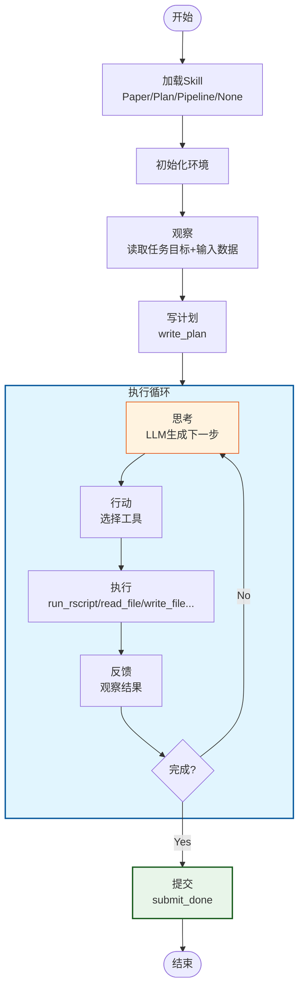
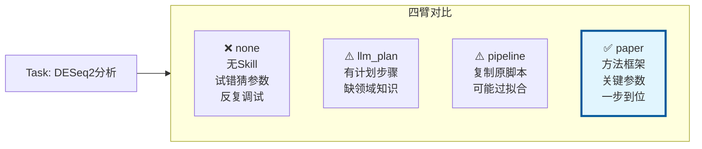
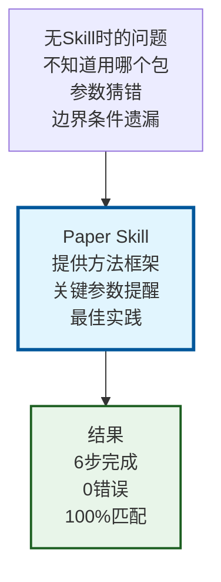
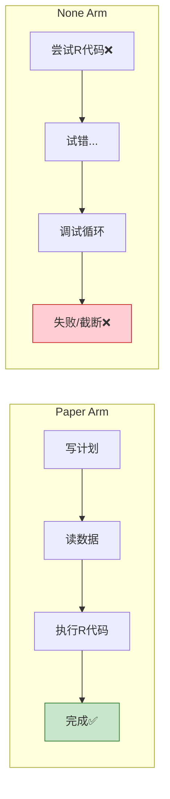
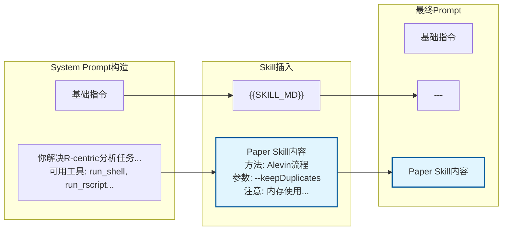
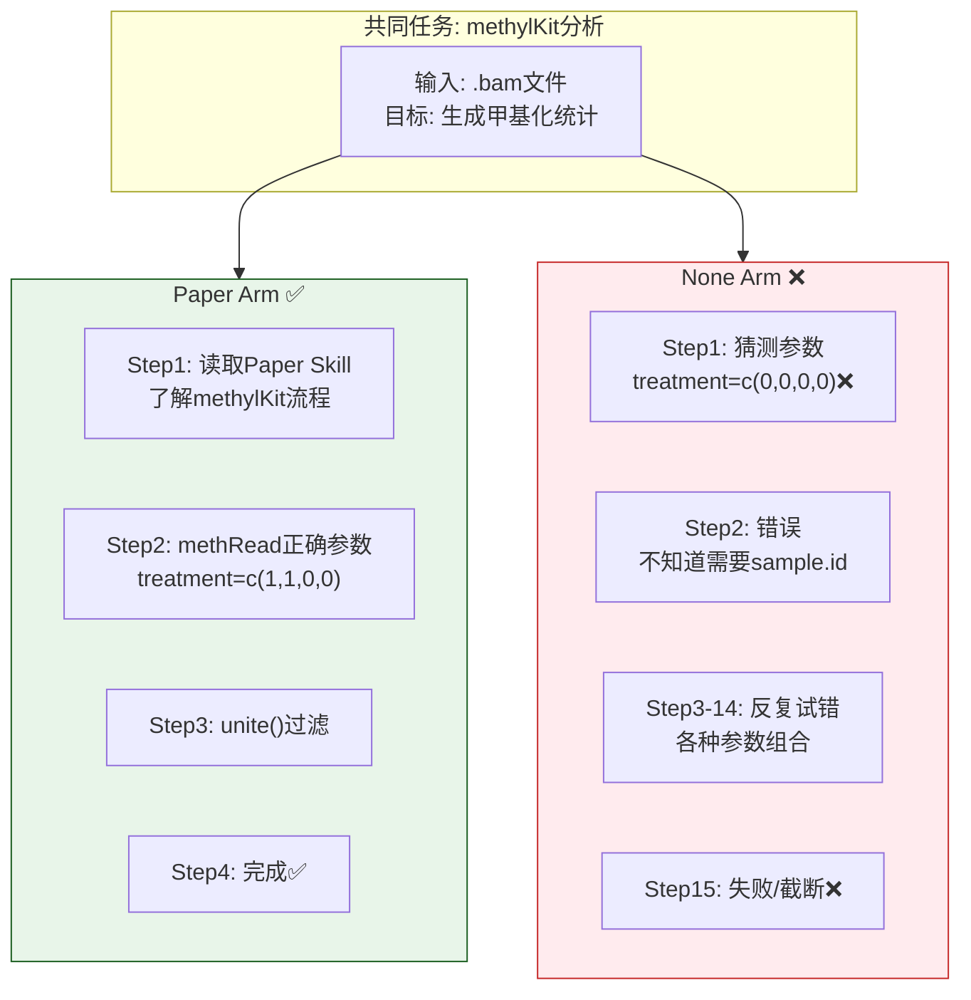
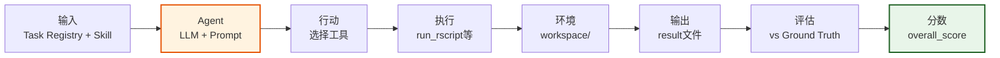

# Agent 执行方法论

## 核心循环：观察 → 思考 → 行动



---

## 四臂差异：Skill如何影响行动



---

## 关键洞察：为什么Paper更强



---

## 典型轨迹对比



---

## 一句话总结

> **Agent的方法论是"观察→思考→行动"循环，Skill决定思考质量。Paper Skill提供学术论文的方法论框架，使Agent一步到位正确执行。**

---

## 补充：详细执行流程

### Step-by-Step 执行示例 (chipseq_plot_macs_qc)

```mermaid
sequenceDiagram
    participant A as Agent
    participant E as Environment
    participant T as Tools
    participant F as 文件系统

    Note over A: 初始状态<br/>已加载Paper Skill

    A->>E: reset()
    E->>F: 读取OBJECTIVE.md
    E->>F: 列出input/目录
    E->>A: 返回观察: 任务目标+文件列表

    A->>A: LLM思考: "需要读取MACS2输出并提取QC统计"
    A->>T: write_plan("1.读取peaks.xls 2.提取QC统计 3.输出tsv")
    T->>F: 写入.plan.md
    T->>A: 确认

    A->>A: LLM思考: "现在执行第1步:读取输入"
    A->>T: read_text_file("input/peaks.xls")
    T->>F: 读取文件
    T->>A: 返回文件内容

    A->>A: LLM思考: "数据已读取，现在用R处理<br/>根据Paper Skill，MACS2输出格式是..."
    A->>T: run_rscript("library(dplyr); peaks <- read.table(...)")
    T->>F: 执行R代码
    F->>T: 返回stdout+stderr
    T->>A: exit=0 (成功)

    A->>T: list_workdir()
    T->>F: 检查output/
    T->>A: 返回文件列表

    A->>A: LLM思考: "输出已生成，检查完成条件"
    A->>T: submit_done(success=true)
    T->>E: 设置done=true
    T->>A: 返回完成确认

    Note over A: 完成<br/>共6步
```

---

## 补充：Skill注入机制



---

## 补充：失败模式对比



---

## 补充：数据流全景


