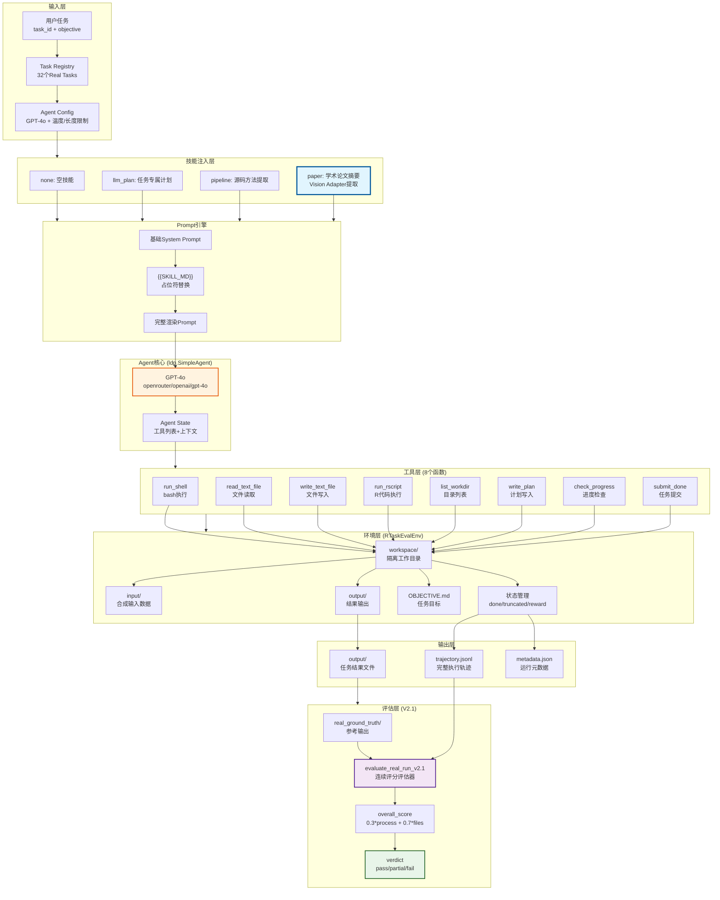
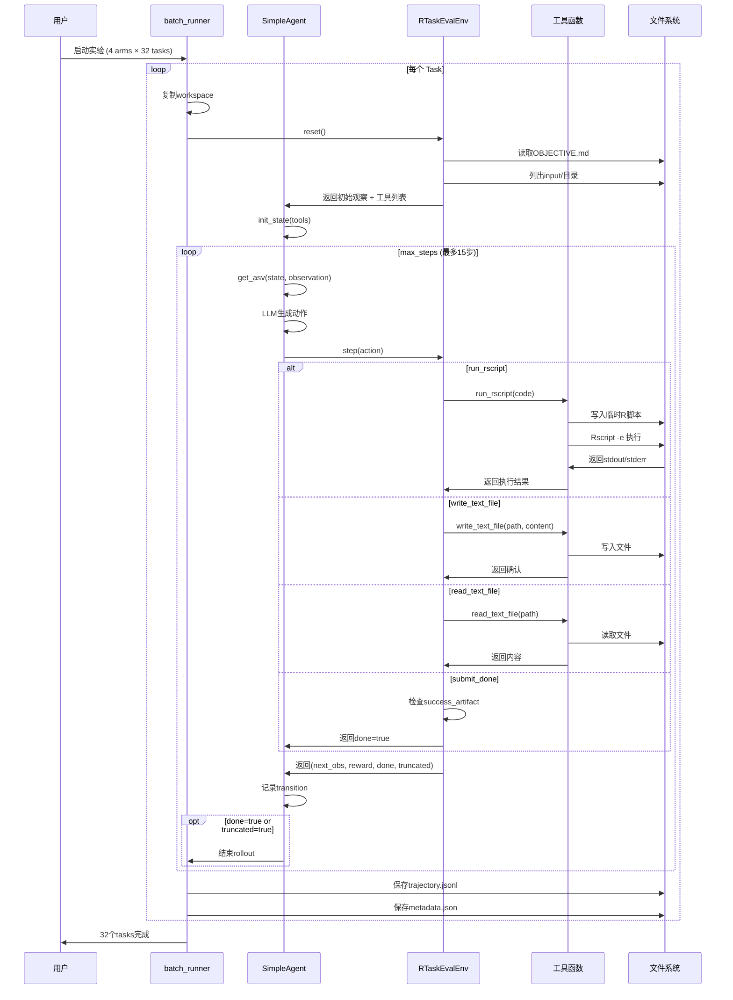
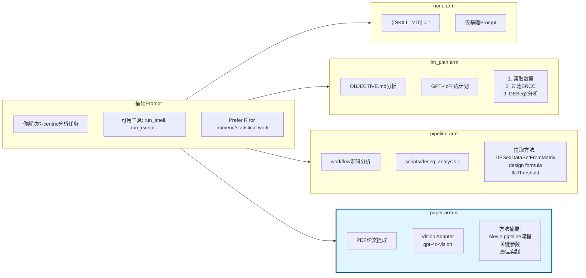
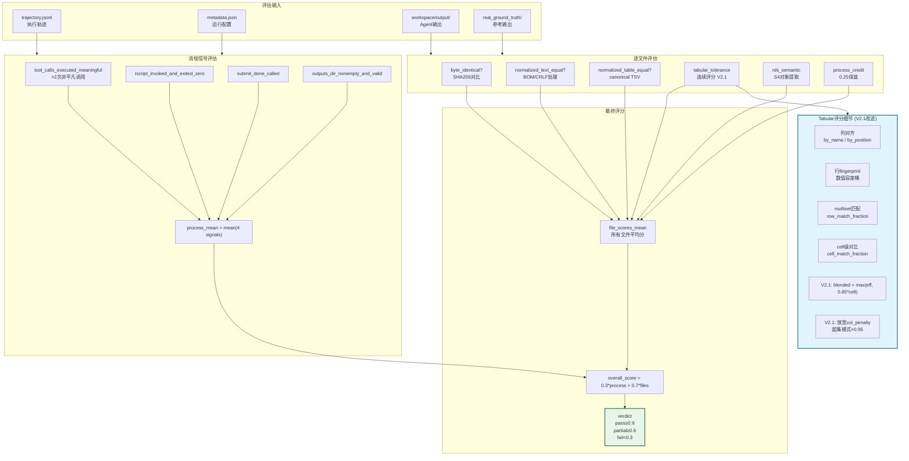
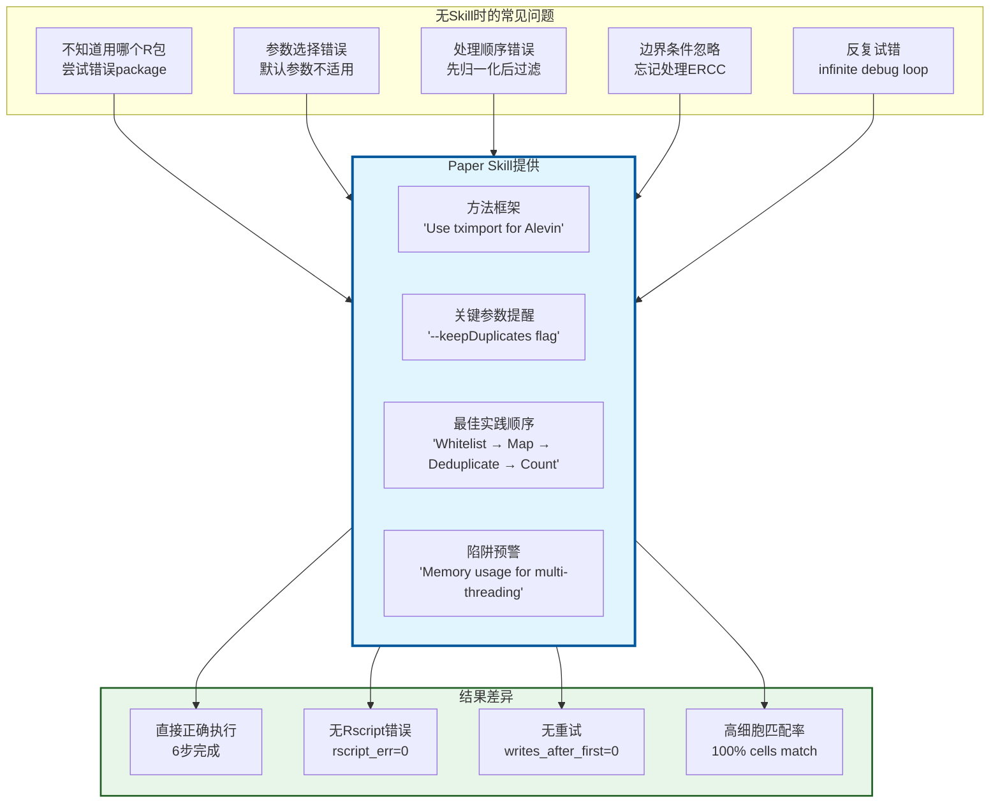

# Paper2Skills Agent 框架结构流程图

## 1. 整体架构概览

---

## 2. Rollout 执行流程

---

## 3. Skill注入对比 (4 Arms)

---

## 4. 评估器V2.1评分流程

---

## 5. 数据流完整链路

```mermaid
flowchart LR
    subgraph Source["源数据层"]
        Workflow["workflow_candidates/<br/>145个真实workflow"]
        Scripts["*.R / *.Rmd<br/>真实R脚本"]
        PaperPDF["literature/<br/>学术论文PDF"]
    end

    subgraph TaskGen["Task生成层"]
        Builder["build_real_r_tasks.py"]
        Synthetic["合成输入数据<br/>seeded random"]
        GroundTruth["运行源脚本<br/>生成reference"]
    end

    subgraph TaskStorage["Task存储"]
        Registry["registry.real.json<br/>32 tasks"]
        Workspace["tasks/real/<br/>workspace/"]
        GT["tasks/real_ground_truth/<br/>隔离存储"]
    end

    subgraph Execution["执行层 (4 Arms)"]
        Batch["batch_runner.py"]
        Agent["SimpleAgent<br/>GPT-4o"]
        Env["RTaskEvalEnv"]
    end

    subgraph Results["结果层"]
        TrajDir["runs/batch_*/<br/>trajectory.jsonl"]
        EvalV2["_evaluations/<br/>V2评分"]
        EvalV21["_evaluations_v21/<br/>V2.1评分"]
    end

    subgraph Analysis["分析层"]
        Compare["4臂对比分析"]
        Report["技术报告<br/>FINAL_4ARM_COMPLETE.md"]
    end

    Workflow --> Scripts
    Scripts --> Builder
    PaperPDF --> Builder
    
    Builder --> Synthetic
    Builder --> GroundTruth
    
    Synthetic --> Workspace
    GroundTruth --> GT
    Builder --> Registry
    
    Registry --> Batch
    Workspace --> Batch
    GT -.-> Batch
    
    Batch --> Agent
    Agent --> Env
    Env --> TrajDir
    
    TrajDir --> EvalV2
    TrajDir --> EvalV21
    GT --> EvalV21
    
    EvalV21 --> Compare
    Compare --> Report

    style PaperPDF fill:#fff3e0,stroke:#e65100
    style EvalV21 fill:#e1f5fe,stroke:#01579b,stroke-width:2px
    style Report fill:#e8f5e9,stroke:#1b5e20,stroke-width:2px
```

---

## 6. Paper Arm 优势机制详解

---

## 图例说明

| 颜色 | 含义 |
|------|------|
| 🟦 蓝色高亮 | Paper Arm / V2.1评估器 (核心改进点) |
| 🟧 橙色 | GPT-4o LLM |
| 🟩 绿色 | 成功/Pass |
| 🟪 紫色 | 评估/分析 |

---

*图表生成于 2024-04-17*  
*对应实验: sweep_v3_paper_final (32 tasks, GPT-4o, V2.1评估)*
