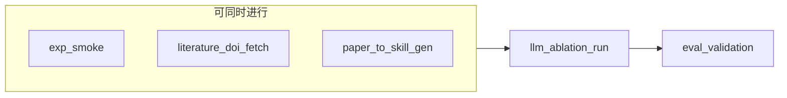

# Subagent 并行分工剧本（提效）

在 Cursor 里可开 **多个 Composer/Agent 对话**，或在外部用 **Task 工具** 并行派发；下面五路 **互不阻塞**（仅最后在「校验员」合并结果）。

| English id | 中文角色 | 输入 | 输出产物 |
|------------|----------|------|----------|
| **`exp_smoke`** | 冒烟实验员 | `registry`（如 `registry.sample_50.json`）、本机 Python 依赖 | `ldp_r_task_eval/runs/batch_*/**` 下 `trajectory.jsonl` + `metadata.json`；进程退出码 |
| **`llm_ablation_run`** | LLM 跑批员 | 同上 registry、固定 `max_steps` + `pilot_openrouter.yaml`、臂 B（无文献）或 C（启用 skill / 扩展 sys_prompt）、API key | 真模型轨迹；实验笔记中的 `arm`、`workflow_id`、`skill_on` |
| **`literature_doi_fetch`** | 文献获取员 | `literature/workflow_literature_map.json` 或 DOI 子集、`UNPAYWALL_EMAIL` | `literature/pdfs/*.pdf` 或失败日志；**不与**实验共享 GPU/API |
| **`paper_to_skill_gen`** | Paper→Skill 生成员 | DOI、或 OA PDF、或 `paperskills` 抽取文本 | `.cursor/skills/paper-*/SKILL.md`（[`paper_to_skill.py`](../literature/tools/paper_to_skill.py)） |
| **`eval_validation`** | 校验员 | `validate_r_task_registry.py`、各次 run 目录、（可选）`evaluation/reference_sum.txt` | 校验通过/失败；离线数值对比表；消融 A/B/C 对比摘要 |

## 并行顺序建议



- **第一批并行**：`exp_smoke`（验证环境）+ `literature_doi_fetch`（下载 OA）+ `paper_to_skill_gen`（从 DOI 先出 skill 骨架，无需 PDF）。
- **第二批**：`llm_ablation_run`（依赖 key；可与第一批错开，避免争用）。
- **最后**：`eval_validation` 汇总。

## 在 Cursor 里「驱动多个 subagent」的写法

把下面整段贴到新 Agent 对话的 **第一条消息**，并只改 `YOUR_ROLE`：

```text
你是本仓库 Paper2Skills 的并行子任务执行者。
角色：YOUR_ROLE 必须是之一：exp_smoke | llm_ablation_run | literature_doi_fetch | paper_to_skill_gen | eval_validation
必读：main/paper_primary_benchmark/experiments/AGENT_DRIVER.md 与 SUBAGENT_PLAYBOOK.md
约束：只完成本角色对应阶段；产物路径写在回复末尾；不要修改其他子任务已锁定的文件除非合并冲突。
```

## 与 AGENT_DRIVER 的关系

总流水线仍以 **[`AGENT_DRIVER.md`](AGENT_DRIVER.md)** 为准；本文件只解决 **谁先做、谁可并行**。
