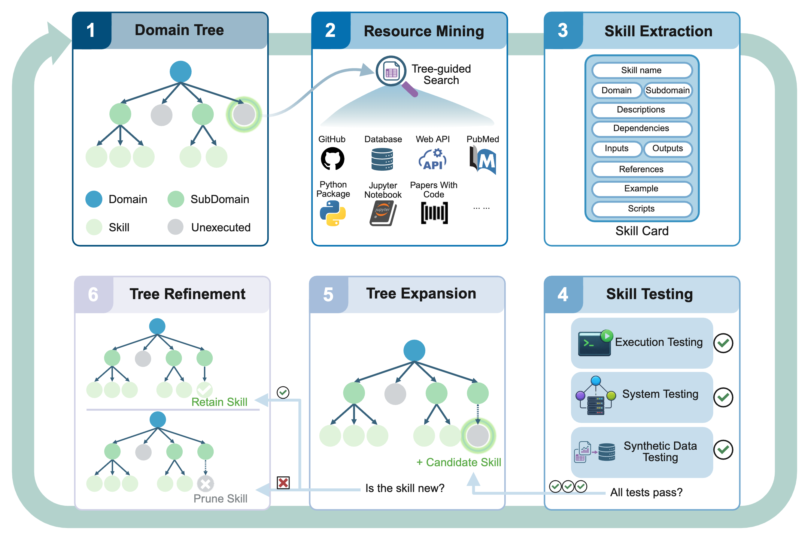

<div align="center">

# SkillFoundry

### Building Self-Evolving Agent Skill Libraries from Heterogeneous Scientific Resources

**Shuaike Shen\*, Wenduo Cheng\*, Mingqian Ma, Alistair Turcan, Martin Jinye Zhang, Jian Ma&dagger;**

Ray & Stephanie Lane Computational Biology Department, School of Computer Science, Carnegie Mellon University

[\*Equal contribution &middot; &dagger;Correspondence: jianma@cs.cmu.edu]

<p>
  <a href="https://ma-compbio-lab.github.io/SkillFoundry/"></a>&nbsp;
  <a href="https://arxiv.org/abs/2604.03964"></a>&nbsp;
  <a href="https://ma-compbio-lab.github.io/SkillFoundry/assets/paper/paper.pdf"></a>&nbsp;
  <a href="https://github.com/ma-compbio-lab/SkillFoundry"></a>
</p>

</div>

---

## Overview

Modern scientific ecosystems are rich in procedural knowledge — repositories, APIs, scripts, notebooks, documentation, databases, and papers — yet much of this knowledge remains fragmented and difficult for agents to operationalize. **SkillFoundry** bridges this gap with a self-evolving framework that converts heterogeneous scientific resources into validated, reusable agent skills.

<div align="center">
  
  <br>
  <sub><b>Figure 1.</b> SkillFoundry framework overview: from domain knowledge tree to validated skill library.</sub>
</div>

### Key Results

| | |
|:---|:---|
| **267+ skills** | mined across **28** scientific domains and **254** subdomains |
| **71.1% novelty** | vs. existing skill libraries (SkillHub, SkillSMP) |
| **5/6 datasets improved** | on [MoSciBench](https://github.com/MoSciBench/MoSciBench) benchmark |
| **Genomics boost** | substantial gains on two challenging genomics tasks |

---

## How It Works

SkillFoundry uses a **domain knowledge tree** as both a search prior and the evolving structure being updated, turning open-ended skill collection into a closed-loop acquisition process:

| Step | Stage | Description |
|:---:|:---|:---|
| 1 | **Tree Construction** | Build a rooted tree where internal nodes are domains/subdomains and leaves are actionable skill targets |
| 2 | **Resource Mining** | Select focus branches and retrieve relevant resources (repos, APIs, papers, notebooks, databases) |
| 3 | **Skill Compilation** | Extract operational contracts and compile into reusable skill packages with metadata, dependencies, and tests |
| 4 | **Multi-Level Validation** | Apply execution testing, system testing, and synthetic-data testing |
| 5 | **Tree Expansion** | Insert validated skills as new leaves, expanding domain coverage |
| 6 | **Refinement & Loop** | Revise, merge, or prune failing/redundant skills; repeat from step 2 |

---

## Repository Structure

```
SkillFoundry/
├── skillfoundry/             # Core automation framework (Python package)
│   ├── cli.py                #   CLI entry point
│   ├── orchestrator.py       #   Skill automation orchestrator
│   ├── campaign.py           #   Long-running campaign runner
│   ├── evaluation.py         #   Hierarchical skill evaluation
│   └── ...
├── scripts/                  # Utility & validation scripts
├── registry/                 # Taxonomy, resource registry, skill index
├── skills/                   # Reusable skill folders grouped by domain (27 domains)
├── tests/                    # Test suites (smoke, integration, regression)
├── site/                     # Generated project page (static HTML/JS/CSS)
├── ref/                      # Reference materials
└── Makefile                  # Build, validate, test, and smoke targets
```

---

## Getting Started

### Prerequisites

- Python 3.10+

### Installation

```bash
git clone https://github.com/ma-compbio-lab/SkillFoundry.git
cd SkillFoundry
```

### Quick Validation

```bash
make validate        # Validate repository structure
make build-site      # Build the project page
make test            # Run unit tests
```

---

## Framework Usage

The `skillfoundry` package provides a CLI for automated skill discovery, compilation, and evaluation. It orchestrates the closed-loop `tree_check -> resource_search -> skill_build -> skill_test -> refresh` pipeline.

### Status

Inspect the current repository summary and identify high-value frontier leaves:

```bash
python3 scripts/sciskill_framework.py --json status --focus-limit 10
```

### Cycle

Run one or more automation loops to discover and build new skills:

```bash
# Single loop
python3 scripts/sciskill_framework.py cycle --loops 1 --verification-mode standard

# Parallel workers with custom focus
python3 scripts/sciskill_framework.py cycle \
  --loops 2 --focus-limit 12 --stage-workers 4 \
  --stages tree_check,resource_search,skill_build,skill_test,refresh \
  --extra-context "Prioritize uncovered leaves in robotics and physics."
```

### Design Skill

Design a skill from a specific task description:

```bash
python3 scripts/sciskill_framework.py design-skill \
  --prompt "Design a skill for literature-backed pathway enrichment benchmarking." \
  --verification-mode validate
```

### Evaluate Skills

Run hierarchical evaluation (correctness repair, benchmarking, novelty checking):

```bash
# Single skill
python3 scripts/sciskill_framework.py evaluate-skills \
  --skill-slug openalex-literature-search \
  --verification-mode validate

# Full library
python3 scripts/sciskill_framework.py evaluate-skills --all --verification-mode none
```

### Campaign

Run a long checkpointable campaign targeting specific domains:

```bash
python3 scripts/sciskill_framework.py campaign \
  --focus-term genomics --focus-term proteomics \
  --max-iterations 100 --max-runtime-minutes 450 \
  --stage-workers 6 --evaluation-workers 6
```

---

## Citation

Citation information will be available once the paper is published. Check back later.

---

## License

This project is developed at [Ma Lab](https://www.cs.cmu.edu/~jianma/), Carnegie Mellon University.
